# Proyecto Integrador — Ecosistema Cherry‑Tech

### Documento único que consolida los tres parciales de Gestión de Servicios de TI

> **Agricultura de precisión para cultivo de tomate Cherry** · Del diseño del servicio a su operación automatizada.

| Campo | Dato |
|---|---|
| **Autor** | Daniel Alejandro Sánchez Ahumada |
| **Registro** | 23310411 |
| **Grado y grupo** | 6N |
| **Materia** | Gestión de Servicios de TI |
| **Profesor** | José Francisco Pérez Reyes |
| **Institución** | Centro de Enseñanza Técnica Industrial (CETI) |
| **Fecha de entrega** | 15 de junio de 2026 |
| **Naturaleza** | Documento integrador de los Parciales I, II y III |

---

## Cómo leer este documento

Este documento no es la suma de tres entregas pegadas: es **una sola historia contada en tres actos**. Cada parcial respondió una pregunta distinta sobre el mismo sistema —Cherry‑Tech— y juntos cierran el ciclo de vida completo de un servicio de software:

| Acto | Parcial | Unidad | Pregunta que responde | Resultado |
|---|---|---|---|---|
| **I — Diseñar** | Primer parcial | Unidad I | *¿Qué es el servicio y qué valor entrega?* | La aplicación **existe** |
| **II — Gobernar** | Segundo parcial | Unidad II | *¿Cómo se gestiona el servicio con disciplina?* | El servicio **se gobierna** |
| **III — Automatizar** | Tercer parcial | Unidad III | *¿Cómo se entrega y opera de forma automática?* | El ciclo es **continuo** |

Para máxima claridad, **cada parcial conserva su propia sección autocontenida**, en el orden Parcial I → II → III, y al final una **síntesis** muestra cómo encajan las tres piezas. Todos los diagramas se incluyen como código **Mermaid** (renderizable) para que el documento sea verificable y editable, no una imagen estática.

---

## Índice general

**PARTE I — PRIMER PARCIAL · Estrategias de TI basadas en servicios (Unidad I)**
1. El servicio antes que el software: la filosofía de Cherry‑Tech
2. Contexto e inspiración: el modelo alemán e islandés
3. Desarrollo de software y su importancia
4. El concepto de servicio aplicado a Cherry‑Tech
5. Capacidad, demanda, continuidad y calidad
6. Arquitectura de microservicios (los 5 microservicios)
7. Diagramas de análisis y diseño (caso de uso, dominio, clases, secuencia, actividades)
8. Historias de usuario y objetivos técnicos
9. ITIL v4 — el Sistema de Valor del Servicio (SVS)
10. Las cuatro dimensiones de la gestión de servicios
11. Conceptos clave de valor (utilidad, garantía, costos, riesgos)
12. Los siete principios guía de ITIL v4
13. Factores externos: análisis PESTLE
14. Normas relacionadas: ISO/IEC 20000 e ISO 22301
15. El proceso de negocio extremo a extremo
16. Administración de riesgos y rentabilidad

**PARTE II — SEGUNDO PARCIAL · Gestión de los Servicios (Unidad II)**
17. El mapa completo de prácticas ITIL v4 (34 prácticas)
18. Práctica: Mejora Continua (PDCA + 7 pasos + FODA)
19. Práctica: Control de Cambios (CAB, tipos, matriz de riesgo, rollback)
20. Práctica: Gestión de Incidentes (priorización + enjambre)
21. Práctica: Gestión de Problemas (5 porqués + error conocido + Circuit Breaker)
22. Práctica: Gestión de Solicitudes de Servicio + Catálogo de Servicios
23. Práctica: Mesa de Servicio (Service Desk)
24. Práctica: Gestión de Niveles de Servicio (SLA + CSAT/NPS)
25. Prácticas Técnicas I — Gestión de Implementación (Deployment)
26. Prácticas Técnicas II — Infraestructura y Plataforma (Respaldo y Recuperación)
27. Prácticas Técnicas III — Desarrollo y Gestión de Software
28. Prácticas generales transversales: Riesgo y Seguridad de la Información
29. Tablero de KPIs — la voz del sistema

**PARTE III — TERCER PARCIAL · Despliegue de servicios: DevOps y CI/CD (Unidad III)**
30. Marco conceptual de la Unidad III y matriz de trazabilidad
31. Arquitectura DevOps integral (las 4 capas)
32. Los 7 conceptos de la Unidad III aplicados
33. El pipeline CI/CD unificado de 8 etapas
34. Configuración técnica real (código de todas las herramientas)
35. Tradicional vs. DevOps y métricas DORA

**SÍNTESIS Y CIERRE**
36. Los tres parciales como una sola historia
37. Conclusiones generales
38. Referencias

---

# PARTE I — PRIMER PARCIAL
## Estrategias de tecnologías de la información basadas en servicios (Unidad I)

> **Nota de presentación.** Esta parte está redactada pensando en que el lector inicial es la **mesa directiva** de una organización agrícola que evalúa contratar el servicio. Las personas que toman decisiones de inversión rara vez están familiarizadas con conceptos de TI, así que cada término técnico se traduce a su valor de negocio. Aun así, no se sacrifica el rigor: todos los conceptos de la Unidad I quedan documentados y trazados.

---

## 1. El servicio antes que el software: la filosofía de Cherry‑Tech

Cherry‑Tech **no es un programa que se vende; es un servicio que se renueva**. La diferencia no es retórica. La Unidad I define un servicio como *"un medio para entregar valor a los clientes al facilitar los resultados que quieren lograr, sin que asuman los costos y riesgos específicos"*. Aterrizado al campo: el agricultor quiere **tomate Cherry de calidad de exportación**; no quiere administrar servidores, programar algoritmos de riego, ni interpretar fórmulas psicrométricas. Cherry‑Tech absorbe ese costo y ese riesgo.

El corazón científico del servicio es el control del **VPD (Vapor Pressure Deficit / Déficit de Presión de Vapor)**, un indicador que combina temperatura y humedad relativa para medir el estrés hídrico de la planta. El rango óptimo para el tomate Cherry está entre **0.8 y 1.2 kPa**; fuera de ese rango, el cultivo sufre: un riego excesivo pudre la raíz, un déficit hídrico estresa la planta de forma irreversible. **Treinta segundos de mal cálculo pueden costar un lote.** Esa criticidad es la justificación de todo lo que sigue.

**El valor se co‑crea.** En ITIL v4, el valor no lo entrega el proveedor en solitario "como quien entrega un paquete": surge de la **colaboración activa** entre proveedor y consumidor. Cherry‑Tech entrega datos precisos de VPD; el agrónomo los usa para decidir; de esa interacción nace el beneficio mutuo. El proveedor (Cherry‑Tech) y el consumidor (la empresa agrícola) forman una **relación de servicio** continua, no una venta única.

---

## 2. Contexto e inspiración: el modelo alemán e islandés

El diseño de Cherry‑Tech tomó dos referencias internacionales concretas, que explican decisiones de arquitectura:

- **Alemania — Interoperabilidad.** La agricultura en ambiente controlado alemana prioriza que los datos **no queden encerrados en una app**, sino que puedan exportarse a sistemas de gestión agrícola más amplios (ERP, plataformas de trazabilidad). De ahí nace el servicio de **exportación CSV/JSON** y el **Reporte de Trazabilidad con QR** como "pasaporte digital" del lote, pensado para compradores internacionales.
- **Islandia (Reikiavik) — Energía y fotoperiodo.** Al carecer de sol suficiente, Islandia usa **energía geotérmica y luz artificial LED** para simular el ciclo solar (control de **fotoperiodo**). Cherry‑Tech incorpora el control de iluminación LED como uno de sus actuadores, habilitando cultivo de ciclo corto independiente de la estación.

El cultivo elegido —tomate Cherry— no es casual: es un **activo biológico delicado, caro y de ciclo corto (≈3 meses)**, lo que lo hace ideal para demostrar gestión de continuidad y calidad en una ventana de tiempo medible. El cultivo tradicional de este producto enfrenta pérdidas de hasta el **40%** por inestabilidad climática; ese es el problema de negocio que Cherry‑Tech ataca.

---

## 3. Desarrollo de software y su importancia

El desarrollo de software es el proceso de crear aplicaciones y sistemas que satisfacen necesidades del negocio y de los usuarios. En un entorno digitalizado, el software es la **piedra angular** del funcionamiento de la organización. La Unidad I destaca cinco aspectos clave que Cherry‑Tech atiende de forma explícita:

| Aspecto | Definición (Unidad I) | Cómo lo cumple Cherry‑Tech |
|---|---|---|
| **Satisfacción de necesidades empresariales** | El software se alinea con objetivos estratégicos. | El sistema se mide por **rendimiento del cultivo**, no por features. |
| **Calidad del software** | Ausencia de bugs, rendimiento, usabilidad. | Cobertura de pruebas ≥ 80 %, validación de outliers, dashboard usable por no‑técnicos. |
| **Tiempo de entrega** | Minimizar el time‑to‑market. | Entrega continua (CI/CD) que despliega en minutos, no meses. |
| **Gestión de riesgos** | Riesgos técnicos, operativos y de negocio. | Modo Supervivencia (edge), Circuit Breaker, plan de rollback. |
| **Mantenimiento y soporte** | Evolución continua post‑lanzamiento. | Ciclo PDCA por sprint + soporte 24/7 para incidentes críticos. |

El **concepto de servicio en el desarrollo de software** desplaza el foco de "escribir código" a "entregar resultados medibles". Cherry‑Tech lo adopta en sus cinco dimensiones: **enfoque en el cliente** (el agrónomo), **valor empresarial** (rendimiento del cultivo), **entrega continua** (sprints de 2 semanas), **gestión del ciclo de vida** (de la ideación al retiro de cada microservicio) y **comunicación efectiva** (revisión de sprint con el cliente).

---

## 4. El concepto de servicio aplicado a Cherry‑Tech

Distingamos los términos de la Unidad I con ejemplos del proyecto:

- **Producto:** una configuración de recursos diseñada para entregar valor; generalmente complejo y no totalmente visible para el consumidor. → *El ecosistema completo de 5 microservicios, sensores, broker e infraestructura.* El cliente no ve todo eso; ve su dashboard.
- **Oferta de servicios:** descripción de los servicios para un grupo de consumidores; puede incluir bienes, acceso a recursos y acciones de servicio.
  - **Bienes** (se transfiere la propiedad): *el kit de sensores ESP32 instalado en el invernadero.*
  - **Acceso a recursos** (licencia, la propiedad sigue siendo del proveedor): *acceso a la app, al dashboard y a la API.*
  - **Acciones de servicio** (las realiza el proveedor): *generación de reportes de trazabilidad, soporte técnico proactivo.*
- **Resultado (outcome):** lo que el cliente logra. → *Tomate de calidad de exportación con pérdidas mínimas.* (El producto es la app; el resultado es la cosecha sana.)
- **Relación de servicio:** cooperación continua proveedor‑consumidor que incluye **provisión** (Cherry‑Tech opera el sistema), **consumo** (el agrónomo usa los datos) y **gestión de la relación** (revisiones, ajustes por temporada).

---

## 5. Capacidad, demanda, continuidad y calidad

Estos cuatro conceptos son el núcleo operativo de la Unidad I y Cherry‑Tech los gestiona como recursos de TI:

| Concepto | Definición | Implementación en Cherry‑Tech |
|---|---|---|
| **Capacidad** | Habilidad del sistema para cumplir su función con recursos suficientes para la demanda actual y futura. | Microservicios escalables horizontalmente; el **MS‑VPD‑Engine** lanza réplicas en fase de maduración del fruto. |
| **Demanda** | Cantidad de recursos requeridos; prever y ajustar la capacidad a las fluctuaciones. | En maduración la frecuencia de muestreo sube; el sistema **escala automáticamente** para absorber el pico. |
| **Continuidad** | Capacidad de mantener y recuperar el servicio ante interrupciones o desastres. | **Modo Supervivencia (Edge Computing):** opera hasta 72 h sin internet con el último estado estable. |
| **Calidad** | Medida en que el servicio cumple requisitos y expectativas, y aporta valor. | SLA de disponibilidad 99.9 %, latencia < 500 ms, reportes certificados con QR. |

Estos cuatro pilares son justamente las áreas que la **garantía** (warranty) de un servicio aborda en ITIL: disponibilidad, capacidad, seguridad y continuidad.

---

## 6. Arquitectura de microservicios

Un **microservicio** es un enfoque arquitectónico que construye la aplicación como un conjunto de servicios independientes y cohesivos en lugar de un monolito. Cherry‑Tech se compone de **cinco microservicios**, cada uno con su propio ciclo de vida, repositorio e imagen Docker.

| Microservicio | Responsabilidad | Stack | SLA crítico |
|---|---|---|---|
| **MS‑Ingestor** | Recibe telemetría MQTT (QoS 1) de los sensores ESP32 | Python + paho‑mqtt | 100 msg/seg |
| **MS‑VPD‑Engine** | Calcula el VPD con fórmula ASABE; filtra outliers | Python + numpy | < 100 ms |
| **MS‑Automation** | Ejecuta reglas de riego/ventilación; Modo Supervivencia | Python + Circuit Breaker | activación < 30 s |
| **MS‑User‑Interface** | API REST + WebSocket para la app móvil | FastAPI + JWT | latencia < 500 ms |
| **MS‑History‑Analytics** | Consultas históricas, reportes PDF de trazabilidad | InfluxDB + ReportLab | query < 100 ms |

**Las 8 características clave de los microservicios (Unidad I)** y su evidencia en el proyecto:

1. **Desacoplamiento** — cada MS se actualiza sin tocar los demás.
2. **Escalabilidad** — el MS‑VPD‑Engine escala solo, sin escalar todo el sistema.
3. **Tecnologías heterogéneas** — Python para cálculo, FastAPI para la API, InfluxDB para series de tiempo.
4. **Resistencia a fallos** — si cae el MS‑Analytics, el riego (MS‑Automation) sigue.
5. **Desarrollo ágil** — equipos trabajan en paralelo por servicio.
6. **Actualizaciones más seguras** — un cambio afecta solo a una parte limitada.
7. **Escalabilidad organizativa** — equipos pequeños y enfocados.
8. **Enfoque en el negocio** — cada servicio mapea a una capacidad agrícola concreta.

**Los 4 desafíos (y cómo se mitigan):** complejidad de gestión → orquestación con Docker Compose; comunicación entre servicios → broker MQTT con QoS 1; consistencia de datos → InfluxDB como fuente única de series de tiempo; pruebas y monitoreo → pipeline CI/CD + Prometheus por servicio.


---

## 7. Diagramas de análisis y diseño

Los siguientes diagramas (elaboración propia) modelan el sistema desde cinco vistas complementarias. Se presentan en notación **Mermaid** para que sean editables y verificables.

### 7.1 Diagrama de casos de uso

Identifica los actores y lo que cada uno puede hacer con el sistema. El **Agrónomo** opera el día a día; el **Dueño** consume valor de negocio; el **Sistema IoT** es un actor secundario que alimenta datos.

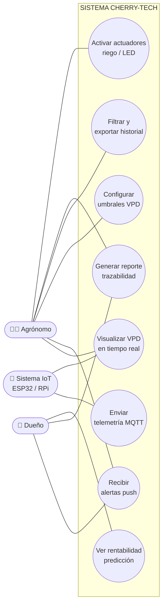

*Relación directa = línea continua del actor a su caso; el Dueño tiene acceso secundario a alertas y reportes para la visión de negocio.*

### 7.2 Diagrama de dominio

Modela las entidades del negocio y sus relaciones (cardinalidad 1‑a‑N). Es la vista conceptual: qué "cosas" existen y cómo se relacionan, sin detalle de implementación.

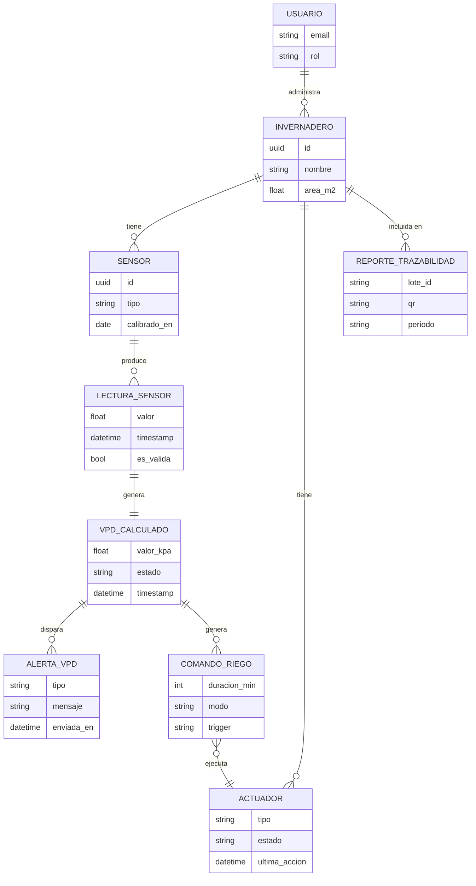

### 7.3 Diagrama de clases

Vista lógica orientada a objetos. Muestra atributos y métodos de cada clase, y las relaciones de **asociación** (flecha continua) y **dependencia/uso** (flecha discontinua). El `CircuitBreaker` es la salvaguarda contra fallos en cascada.

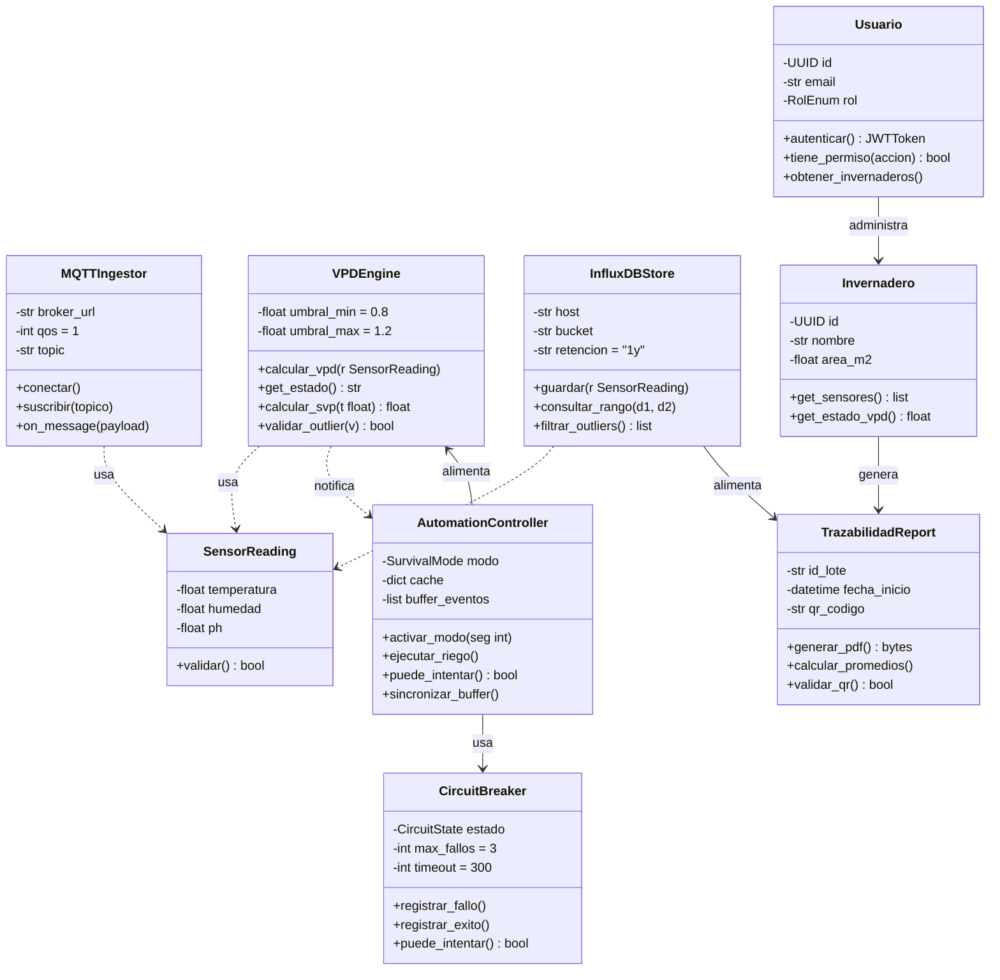

### 7.4 Diagrama de secuencia — flujo crítico del riego automatizado

El "camino feliz": una lectura llega vía MQTT, se calcula el VPD, se valida contra umbrales y se dispara (o no) el riego. Objetivo de latencia **sensor → dashboard < 500 ms**. Cada retorno es un punto donde puede materializarse un incidente (y por tanto, donde debe haber métricas).

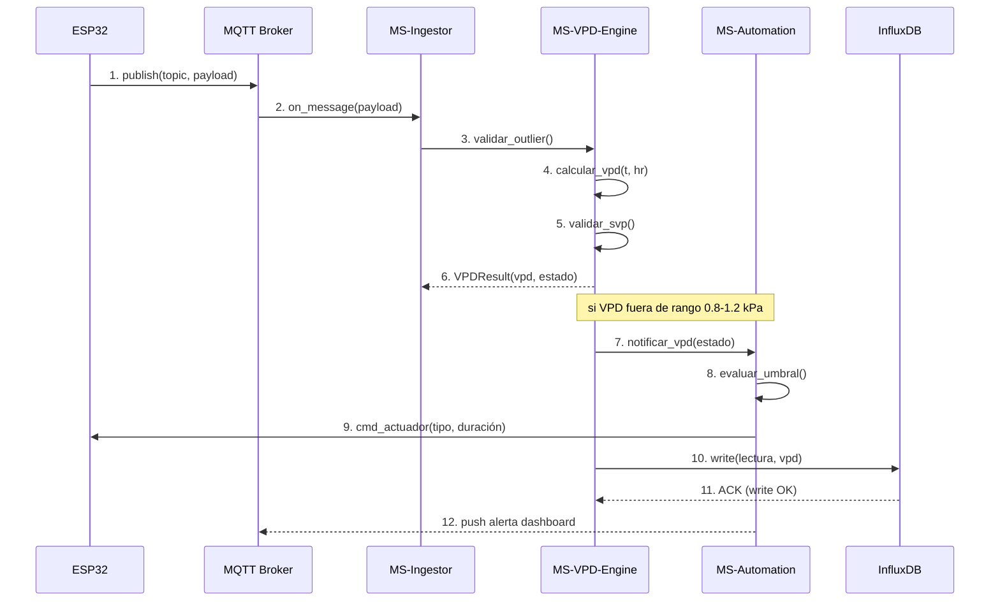

### 7.5 Diagrama de actividades — el ciclo operativo

El sistema opera en un **loop permanente** con carriles (swimlanes). Los rombos de decisión (¿red activa?, ¿outlier?, ¿VPD fuera de rango?) son el núcleo de la lógica de negocio: **cada uno es un candidato natural a prueba unitaria**, y cada flujo de error es un candidato a Registro de Problema si reaparece.

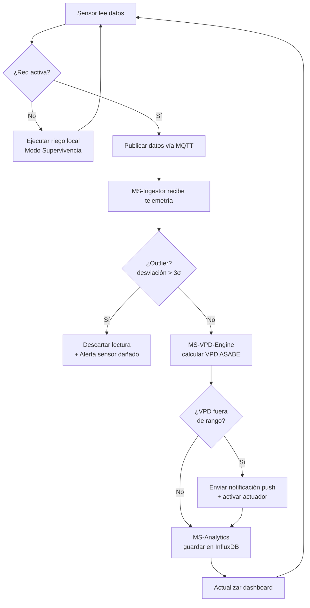


---

## 8. Historias de usuario y objetivos técnicos

El servicio se especificó mediante **15 historias de usuario** repartidas en dos módulos. Cada una tiene criterios de aceptación medibles —la base de las pruebas automatizadas del Parcial III.

### Módulo A — Dashboard y Gestión (App móvil)

| # | Usuario | Quiero… | Criterios de aceptación |
|---|---|---|---|
| 1 | Agrónomo | Visualizar el VPD en un panel central | Actualización vía WebSocket; alerta visual si sale de 0.8–1.2 kPa |
| 2 | Agro‑empresario | Recibir notificaciones push ante alertas críticas | Entrega < 3 s; persistencia en log del sistema |
| 3 | Agrónomo | Filtrar el historial por fechas y sensores | Selector inicio/fin; exportación CSV con timestamp |
| 4 | Administrador | Configurar umbrales por variable | Validación numérica; sincronización inmediata al MS‑Automation |
| 5 | Usuario | Ver un Gemelo Digital del invernadero | Mapa gráfico; color por promedio de sensores por zona |
| 6 | Gerente de Calidad | Generar reporte PDF de trazabilidad | Gráficas y promedios; QR único de validación por lote |
| 7 | Usuario | Autenticarme con token seguro (JWT) | Token cifrado; expulsión tras 60 min de inactividad |

### Módulo B — Core Engine e IoT (Backend)

| # | Usuario | Quiero… | Criterios de aceptación |
|---|---|---|---|
| 8 | Sistema (Ingestor) | Recibir telemetría vía MQTT | QoS 1; procesamiento < 100 ms |
| 9 | Sistema (VPD‑Engine) | Calcular el VPD automáticamente | Fórmula ASABE; rechazo de outliers (humedad < 0 % o > 100 %) |
| 10 | Sistema (Automation) | Ejecutar Modo Supervivencia ante caída de red | Activación tras 30 s sin latido; parámetros en EEPROM/SD local |
| 11 | Sistema (Analytics) | Descartar lecturas fuera de rango | Limpieza de picos; notificar posible sensor dañado |
| 12 | Arquitecto TI | Que la BD sea contenedor Docker independiente | Aislamiento de red; volumen persistente externo |
| 13 | Sistema (CI/CD) | Ejecutar pruebas unitarias antes de cada despliegue | Lógica de riego al 100 %; bloqueo de despliegue si falla un test |
| 14 | Sistema | Almacenar datos en series de tiempo | InfluxDB; compresión de datos antiguos |
| 15 | Sistema | Implementar patrón Circuit Breaker | Abrir circuito tras 3 fallos; reintento tras enfriamiento |

### Objetivos técnicos (resumen)

- **Arquitectura:** ≥ 5 microservicios dockerizados, aislamiento de fallas del 100 %.
- **CI/CD:** pruebas unitarias que bloqueen versiones con errores de lógica de riego.
- **IoT:** broker MQTT con QoS 1; latencia sensor→dashboard ≤ 500 ms.
- **Resiliencia:** control local en < 30 s tras pérdida de nube; autonomía hasta 72 h; buffering local SD/EEPROM.
- **Precisión:** error de cálculo VPD < 1.5 % contra tablas ASABE; descarte del 100 % de outliers.
- **UX:** estado de salud identificable en < 3 s mediante códigos de color; reportes con firma digital.

---

## 9. ITIL v4 — el Sistema de Valor del Servicio (SVS)

**ITIL 4** es el marco que da disciplina a la gestión de servicios de TI; está diseñado para integrar Lean, Agile y DevOps. Su componente central es el **Sistema de Valor del Servicio (SVS)**, que describe cómo todos los componentes y actividades de la organización trabajan juntos para crear valor. El SVS tiene **cinco componentes**:

1. **La cadena de valor del servicio** (modelo operativo central).
2. **Las prácticas ITIL** (las 34 que se desarrollan en el Parcial II).
3. **Los principios rectores** (los 7 que guían cada decisión).
4. **La gobernanza** (alineación con la dirección estratégica).
5. **La mejora continua** (presente en todos los componentes).

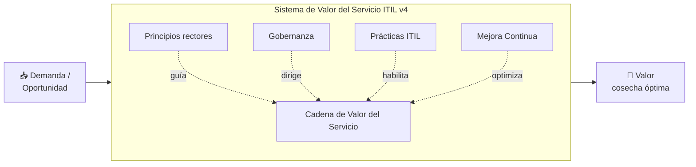

### La cadena de valor del servicio — 6 actividades

La cadena de valor es un modelo flexible de **seis actividades** que se combinan para formar flujos de valor. Cada actividad transforma entradas en salidas usando combinaciones de prácticas ITIL.

| Actividad | Propósito | Aplicación en Cherry‑Tech |
|---|---|---|
| **Planear** | Visión y dirección compartida en las 4 dimensiones. | Roadmap por temporada de cultivo; backlog priorizado. |
| **Mejorar** | Mejora continua de productos, servicios y prácticas. | Ajuste de algoritmos VPD tras cada cosecha (datos InfluxDB). |
| **Involucrar / Participar** | Entender necesidades de los interesados; relaciones. | Levantamiento de requerimientos con los agrónomos. |
| **Diseñar y Transición** | Cumplir calidad, costo y tiempo de comercialización. | Diseño del dashboard y portal de servicios. |
| **Obtener / Construir** | Componentes disponibles según especificaciones. | Desarrollo del VPD‑Engine y los contenedores Docker. |
| **Entrega y Asistencia** | Entregar y soportar según lo acordado. | Implementación del dashboard + soporte proactivo. |

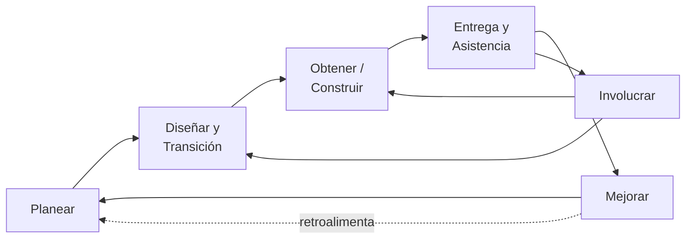

---

## 10. Las cuatro dimensiones de la gestión de servicios

Para garantizar un enfoque **holístico**, cada componente del SVS debe considerarse desde cuatro dimensiones. Descuidar una produce servicios subóptimos.

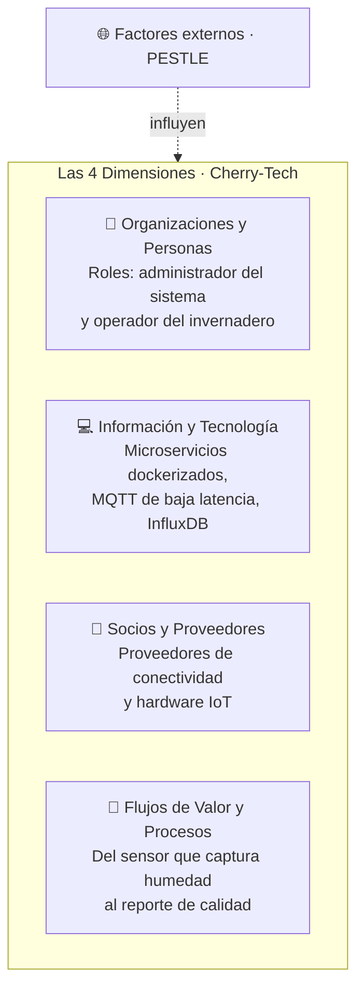

- **Organizaciones y personas:** roles claros (administrador vs. operador), cultura, competencias.
- **Información y tecnología:** la información que gestionan los servicios y la tecnología que los habilita (microservicios, MQTT, InfluxDB, JWT).
- **Socios y proveedores:** relaciones con proveedores de conectividad y hardware IoT que aseguran la cadena de suministro.
- **Flujos de valor y procesos:** el camino óptimo desde que el sensor captura la humedad hasta que el reporte de calidad llega al cliente.

---

## 11. Conceptos clave de valor: utilidad, garantía, costos y riesgos

### Creación de valor y roles del consumidor

El valor es la **utilidad e importancia percibida** de los beneficios de algo. ITIL v4 reconoce tres roles del consumidor:

- **Patrocinador** — autoriza el presupuesto. *(El dueño de la empresa agrícola.)*
- **Cliente** — define requisitos y asume responsabilidad de los resultados. *(El gerente de producción.)*
- **Usuario** — utiliza el servicio. *(El agrónomo en el invernadero.)*

### Utilidad y Garantía (fit for purpose / fit for use)

| | Definición | En Cherry‑Tech |
|---|---|---|
| **Utilidad** (*fit for purpose*) | Funcionalidad para satisfacer una necesidad; respalda el desempeño o elimina restricciones. | Elimina la variabilidad climática controlando el VPD. |
| **Garantía** (*fit for use*) | Aseguramiento de que se cumplen los requisitos; aborda disponibilidad, capacidad, seguridad y continuidad. | Disponibilidad 24×7, cifrado JWT, Modo Supervivencia. |

Un servicio crea valor **solo cuando tiene utilidad Y garantía**.

### Costos y riesgos (eliminados vs. impuestos)

| | **Eliminados** (parte de la propuesta de valor) | **Impuestos** (costo/riesgo del consumo) |
|---|---|---|
| **Costos** | Mantenimiento de servidores físicos, personal de TI. | Precio de suscripción, capacitación del agrónomo. |
| **Riesgos** | Pérdida del cultivo por error humano, fallo de hardware propio. | Dependencia del proveedor, posible brecha de seguridad. |

> Un servicio **solo puede reducir** los riesgos del consumidor; no los elimina por completo: cambia su naturaleza. Cherry‑Tech transfiere el riesgo de "perder la cosecha por mal manejo" hacia "confiar en un proveedor que garantiza 99.9 %".

---

## 12. Los siete principios guía de ITIL v4

Cada decisión de Cherry‑Tech se puede justificar con estos principios:

1. **Enfoque en el valor** — todo se mide por su impacto en la cosecha, no por features.
2. **Comienza donde estás** — se reutiliza hardware IoT existente; no se reinventa.
3. **Progresa iterativamente con retroalimentación** — sprints de 2 semanas con datos reales.
4. **Colabora y promueve la visibilidad** — dashboard compartido entre equipo y cliente.
5. **Piensa y trabaja holísticamente** — las 4 dimensiones se consideran juntas.
6. **Mantenlo simple y práctico** — un dashboard que un no‑técnico entiende en 3 s.
7. **Optimiza y automatiza** — el pipeline CI/CD encarna literalmente este principio.

---

## 13. Factores externos: análisis PESTLE

Los proveedores no operan aislados. **PESTLE** analiza los factores que influyen o restringen al servicio:

| Factor | Impacto en Cherry‑Tech |
|---|---|
| **Político** | Apoyo de programas SAGARPA/FIRA al agro de precisión. |
| **Económico** | Fluctuación del precio de semiconductores (afecta el hardware). |
| **Social** | Curva de aprendizaje del agricultor tradicional. |
| **Tecnológico** | Tendencia hacia IoT/IA en agricultura; oportunidad de expansión. |
| **Legal** | Cambios regulatorios en manejo de datos y trazabilidad de exportación. |
| **Ambiental** | Eficiencia energética (inspiración islandesa); sostenibilidad del riego. |

---

## 14. Normas relacionadas: ISO/IEC 20000 e ISO 22301

- **ISO/IEC 20000 (Gestión de Servicios de TI):** define requisitos para establecer, operar y mejorar un sistema de gestión de servicios. ITIL es la guía práctica para cumplir sus requisitos; Cherry‑Tech aplica sus prácticas (cambios, incidentes, niveles de servicio) para alinearse.
- **ISO 22301 (Continuidad del Negocio):** enfoque sistemático para responder a interrupciones (desastres, fallos). El **Modo Supervivencia** y el procedimiento de **Respaldo y Recuperación** (RTO 2 h / RPO 15 min) son la materialización de esta norma en Cherry‑Tech.

---

## 15. El proceso de negocio extremo a extremo

Visto como proceso de negocio amplio (como pide el Parcial I), Cherry‑Tech va **de la identificación de requerimientos a la operación y mejora continua**, y en cada eslabón encaja una actividad de la cadena de valor ITIL:

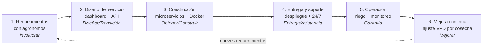

---

## 16. Administración de riesgos y rentabilidad (para la mesa directiva)

- **Costos eliminados:** al contratar Cherry‑Tech se elimina el costo de mantener servidores físicos y el riesgo de pérdida total por error humano.
- **Riesgos mitigados:** el riesgo de desconexión se neutraliza con el **Modo Supervivencia (Edge Computing)** — el cultivo vive incluso sin internet.
- **Garantías de servicio:** disponibilidad 99.9 % por contenedores redundantes; continuidad por control local; seguridad por JWT en toda comunicación.
- **Retorno:** se ataca la pérdida tradicional de hasta 40 % del cultivo, convirtiendo un proceso agrícola en un **servicio de TI de clase mundial**.

> *"Nuestra meta es que usted se preocupe por vender sus tomates, mientras nosotros nos ocupamos de que crezcan perfectos."*


---
---

# PARTE II — SEGUNDO PARCIAL
## Gestión de los Servicios — ITIL v4 aplicado a Cherry‑Tech (Unidad II)

> Si el Parcial I demostró que el servicio **existe**, el Parcial II demuestra que el servicio **se gobierna**. Aquí cada práctica del SVS se aterriza con flujos, formatos, métricas y código real. *El software que no se gestiona, se degrada; el software que se gestiona, evoluciona.*

---

## 17. El mapa completo de prácticas ITIL v4 (34 prácticas)

En ITIL, una **práctica de gestión** es un conjunto de recursos organizacionales diseñados para realizar un trabajo o lograr un objetivo. El SVS incluye **34 prácticas** en tres categorías:

- **14 prácticas de gestión general** (adoptadas de la gestión empresarial).
- **17 prácticas de gestión de servicio** (propias del ITSM).
- **3 prácticas de gestión técnica** (deployment, infraestructura, desarrollo de software).

Cherry‑Tech implementa y documenta las siguientes, organizadas por categoría. **Esta parte cubre explícitamente las tres prácticas técnicas y las prácticas de servicio que cierran el ciclo de atención al cliente** (solicitudes, mesa de servicio, niveles de servicio), además de las de mejora, cambios, incidentes y problemas.

| Categoría | Práctica | Sección | Estado |
|---|---|---|---|
| General | Mejora Continua | §18 | ✔ |
| General | Gestión de Riesgos | §28 | ✔ |
| General | Seguridad de la Información | §28 | ✔ |
| Servicio | Control de Cambios (Change Enablement) | §19 | ✔ |
| Servicio | Gestión de Incidentes | §20 | ✔ |
| Servicio | Gestión de Problemas | §21 | ✔ |
| Servicio | Gestión de Solicitudes de Servicio | §22 | ✔ |
| Servicio | Mesa de Servicio (Service Desk) | §23 | ✔ |
| Servicio | Gestión de Niveles de Servicio (SLA) | §24 | ✔ |
| Servicio | Monitoreo y Gestión de Eventos | §29 | ✔ |
| Técnica | Gestión de Implementación (Deployment) | §25 | ✔ |
| Técnica | Infraestructura y Plataforma | §26 | ✔ |
| Técnica | Desarrollo y Gestión de Software | §27 | ✔ |

### El matrimonio microservicios ↔ prácticas ITIL

| Característica del microservicio | Práctica ITIL que lo gobierna | Beneficio en Cherry‑Tech |
|---|---|---|
| Despliegue independiente por servicio | Control de Cambios (Estándar/Normal) | Cambios atómicos sin afectar todo el sistema |
| Aislamiento de fallos | Incidentes + Problemas | Un incidente en Analytics no tumba el riego |
| CI/CD y pruebas automatizadas | Mejora Continua + Desarrollo de Software | Velocidad sin sacrificar calidad |
| Observabilidad por servicio | Monitoring & Event Management | MTTR bajo: detectamos antes de que el cultivo lo sienta |
| Edge Computing (Modo Supervivencia) | Gestión de Continuidad del Servicio | 24–72 h de operación autónoma sin red |

---

## 18. Práctica: Mejora Continua

**Propósito:** alinear las prácticas y servicios con las necesidades cambiantes del negocio mediante la mejora continua de productos, servicios y prácticas. En Cherry‑Tech: *el invernadero cambia con las estaciones, el cultivo con la semana, y el software debe cambiar con ellos.*

**Actividades clave** (Unidad II): fomentar la cultura de mejora, asegurar tiempo/presupuesto, identificar y registrar oportunidades, evaluar y priorizar, hacer casos de negocio, planificar e implementar, medir resultados y coordinar la mejora en toda la organización.

### 18.1 El motor PDCA

Cada **sprint de 2 semanas** completa una vuelta del ciclo Plan‑Do‑Check‑Act:

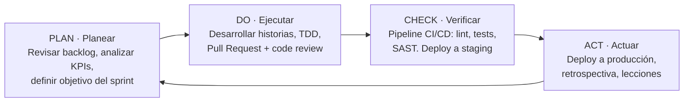

| Fase | Ceremonia Scrum asociada |
|---|---|
| PLAN | Sprint Planning (lunes 09:00, 2 h máx.) |
| DO | Daily Standup (15 min) + desarrollo |
| CHECK | Pipeline automático + Sprint Review (viernes) |
| ACT | Sprint Retrospective (viernes, 45 min) |

### 18.2 El modelo de mejora continua de ITIL — los 7 pasos

Caso real: **migración del Modo Supervivencia de 24 h a 72 h** (release v1.1.0, abril 2026).

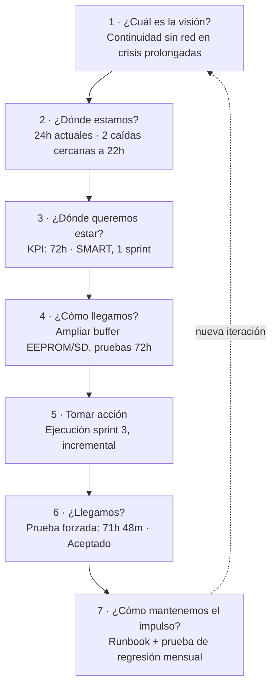

| Paso | Trabajo clave (Unidad II) |
|---|---|
| 2 ¿Dónde estamos? | Evaluación de referencia: percepción del usuario, cultura, gente, procesos, tecnología. Técnica: **FODA**. |
| 3 ¿Dónde queremos estar? | Definir **SMART‑CSF** (Factores Críticos de Éxito) y **KPIs**. |
| 5 Tomar acción | Enfoque ágil/iterativo; gestión del riesgo. |
| 7 Mantener el impulso | Documentar lecciones, gestión del conocimiento, recompensar comportamiento. |

### 18.3 FODA — evaluación del estado actual

| **Fortalezas** | **Oportunidades** |
|---|---|
| Arquitectura de microservicios desacoplada | Mercado LATAM poco saturado |
| Cálculo VPD basado en estándar ASABE | Tendencia hacia agro de precisión |
| Modo Supervivencia (edge computing) | Posible expansión a otros cultivos |
| Pipeline CI/CD con > 80 % cobertura | Apoyo de programas SAGARPA/FIRA |
| Stack moderno: Docker, MQTT, InfluxDB | Datos como activo: API monetizable |
| **Debilidades** | **Amenazas** |
| Dependencia de hardware específico | Ciberataques a infraestructura IoT |
| Curva de aprendizaje del usuario final | Competidores con mayor capital (John Deere) |
| Costo inicial de implementación alto | Conectividad rural deficiente |
| Calibración manual de sensores | Cambios regulatorios en datos |
| Equipo de desarrollo reducido (MVP) | Fluctuación de precio de semiconductores |

### 18.4 Métodos complementarios al PDCA

ITIL recomienda **cultivar pocos métodos clave**. Cherry‑Tech eligió tres que conviven sin pisarse:

| Método | Aporte | Aplicación |
|---|---|---|
| **LEAN** | Eliminación de desperdicio | Análisis trimestral de deuda técnica; baja de endpoints no usados |
| **Ágil (Scrum)** | Iteraciones cortas con cadencia | Sprints de 2 semanas, backlog MoSCoW |
| **DevOps** | Mejoras bien diseñadas y aplicadas | Pipeline que bloquea merge sin tests; Rolling Update |

---

## 19. Práctica: Control de Cambios (Change Enablement)

**Propósito:** maximizar el número de cambios exitosos, asegurando que los riesgos se evalúen, autorizando cambios y administrando el cronograma. *Un cambio* es la adición, modificación o eliminación de cualquier cosa que pueda afectar los servicios. En un sistema que controla riego automatizado, **un cambio mal hecho puede perder un cultivo**.

La persona/grupo que autoriza es la **Autoridad de Cambio**; en Cherry‑Tech, el **CAB (Change Advisory Board)**.

### 19.1 Tipos de cambio

| Tipo | Definición ITIL | Ejemplo Cherry‑Tech | Aprobador | Tiempo |
|---|---|---|---|---|
| **Estándar** | Preautorizado, bajo riesgo, documentado. Inicia con solicitud de servicio. | Ajuste de umbrales VPD por temporada (0.8–1.2 → 0.9–1.3 kPa) | Líder Técnico | 4 h |
| **Normal** | Planificado, requiere evaluación completa de riesgo/impacto. | Nueva versión MS‑VPD‑Engine v1.2.0 | CAB | 5 días háb. |
| **Mayor** | Alto impacto en arquitectura o continuidad. | Migración InfluxDB on‑prem → Cloud | Dirección + CAB | 10 días háb. |
| **Emergencia** | Urgente: incidente o parche de seguridad crítico. | Parche CVE en librería MQTT; rotación JWT | Líder Técnico + notif. | 2 h |

### 19.2 Flujo del proceso de cambio (CAB) — 9 etapas

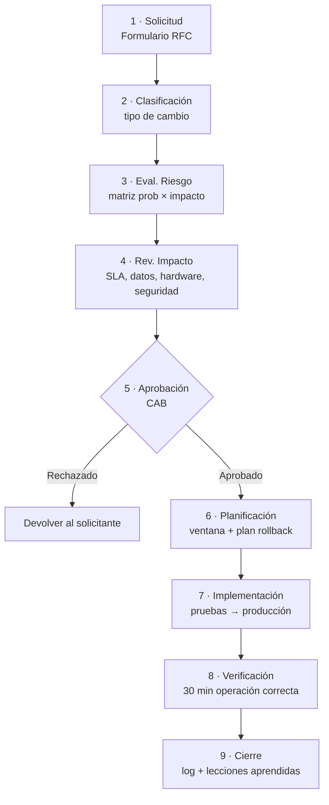

> Los cambios **Estándar** omiten las etapas 3‑4; los de **Emergencia** comprimen 2‑4 en una reunión de 30 min.

### 19.3 Matriz de riesgos (probabilidad × impacto)

| Prob. \ Impacto | BAJO | MEDIO | ALTO | CRÍTICO |
|---|---|---|---|---|
| **ALTA** | Medio | Alto | Crítico | Crítico |
| **MEDIA** | Bajo | Medio | Alto | Crítico |
| **BAJA** | Bajo | Bajo | Medio | Alto |

> Un riesgo **CRÍTICO** sin plan de mitigación documentado **bloquea automáticamente** la aprobación.

### 19.4 Plan de rollback — el seguro de cada despliegue

| Componente | Estrategia de rollback | Tiempo máx. |
|---|---|---|
| Microservicio (Docker) | Revertir imagen a versión anterior (`docker service update`) | 5 min |
| Base de datos InfluxDB | Restaurar snapshot previo verificado | 15 min |
| Firmware ESP32 / RPi | Re‑flashear firmware anterior desde repositorio | 10 min |
| Configuración MQTT/TLS | Restaurar config previa desde servidor versionado | 5 min |
| Umbrales VPD | `PUT /thresholds/restore-last-stable` en MS‑Automation | 2 min |

**Contribución a la cadena de valor:** planea el nivel de control (Planear), muchas mejoras provocan cambios (Mejorar), participación de interesados (Involucrar), servicios nuevos disparan cambios (Diseñar/Transición), los componentes están sujetos a control (Obtener/Construir).


---

## 20. Práctica: Gestión de Incidentes

**Propósito:** minimizar el impacto negativo de los incidentes restaurando el funcionamiento normal lo más rápido posible. *Un incidente* es una interrupción no planificada o reducción de calidad de un servicio. **Premisa: resolver primero, investigar después** (la causa raíz se gestiona en Problemas).

### 20.1 Priorización (urgencia × impacto)

| Prioridad | Criterio | Ejemplo Cherry‑Tech | SLA respuesta | SLA resolución |
|---|---|---|---|---|
| **P1** | Crítico — interrupción total, riesgo directo al cultivo | MS‑Automation no ejecuta riego, sin Modo Supervivencia | 15 min | 2 h |
| **P2** | Alto — degradación severa | VPD con error > 15 %; dashboard sin datos | 30 min | 4 h |
| **P3** | Medio — degradado con workaround | Notificaciones con > 10 s de lag; CSV incompleto | 2 h | 24 h |
| **P4** | Bajo — impacto mínimo | Lag visual en Gemelo Digital; PDF desalineado | 8 h | 5 días |

### 20.2 Técnica de enjambre (swarming)

Para incidentes P1/P2, **muchas partes interesadas trabajan juntas** hasta que queda claro quién está mejor ubicado para continuar.

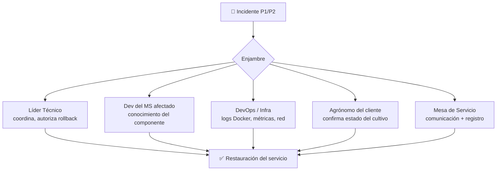

### 20.3 Caso real — TI‑2026‑001 (P1)

| Atributo | Valor |
|---|---|
| ID del Ticket | TI‑2026‑001 |
| Detección | 01/04/2026 02:00 hrs (alerta automática) |
| Servicio afectado | MS‑Automation (riego programado) |
| Prioridad | P1 — Crítico |
| Workaround | Activación manual del Modo Supervivencia desde el panel del agrónomo |
| Diagnóstico | El cliente MQTT perdió la suscripción a `/control/riego` tras pico de latencia del broker |
| Solución | Rollback de configuración MQTT + reinicio del contenedor |
| Tiempo de resolución | 1 h 42 m (dentro del SLA P1 de 2 h) |
| Genera Problema | Sí — **RP‑2026‑001** |

**Contribución a la cadena de valor:** registros de incidentes (Mejorar), comunicación con el usuario (Involucrar), gestión en soporte (Entrega y Asistencia).

---

## 21. Práctica: Gestión de Problemas

**Propósito:** reducir la probabilidad e impacto de los incidentes identificando sus causas reales y potenciales. *Un problema* es la causa (o causa potencial) de uno o más incidentes. *Un error conocido* es un problema analizado pero no resuelto.

### 21.1 Las tres fases

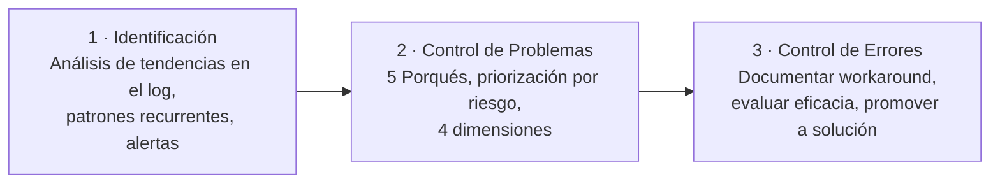

### 21.2 Análisis de causa raíz — RP‑2026‑001 (técnica de los 5 Porqués)

| # | Pregunta | Respuesta |
|---|---|---|
| 1 | ¿Por qué falló el riego nocturno? | El MS‑Automation perdió la suscripción a `/control/riego` |
| 2 | ¿Por qué perdió la suscripción? | El cliente MQTT recibió timeout y no se reconectó |
| 3 | ¿Por qué hubo timeout? | El broker acumuló latencia > 500 ms durante 90 s |
| 4 | ¿Por qué se acumuló latencia? | La cola se saturó con telemetría no consumida del MS‑Analytics |
| 5 | ¿Por qué se saturó la cola? | El MS‑Analytics, en batch nocturno, consumía a 1/3 del ritmo de ingesta |

> **Causa raíz:** arquitectura mono‑broker que comparte tráfico crítico (control) y analítico (telemetría) sin separación de prioridades.

### 21.3 Workaround vs. solución definitiva

| Tipo | Acción | Estado |
|---|---|---|
| Workaround | Mover el batch del MS‑Analytics fuera de la ventana de riego (→ 04:30–08:30) | Aplicado 02/04/2026 |
| Workaround | Reconexión automática agresiva del cliente MQTT con backoff exponencial | Aplicado 03/04/2026 |
| Solución definitiva | Separar el broker en dos instancias (control vs. telemetría) | RFC en sprint 5 |
| Solución preventiva | QoS prioritario para `/control/*` sobre `/telemetry/*` | En diseño |

### 21.4 El Circuit Breaker como salvaguarda (código real)

El patrón Circuit Breaker en el MS‑Automation aísla fallos transitorios como el descrito: cuando el circuito está **OPEN**, el servicio entra en Modo Supervivencia con la última config cacheada.

```python
# ms_automation/circuit_breaker.py
from enum import Enum
from time import time

class CircuitState(Enum):
    CLOSED = "closed"        # operación normal
    OPEN = "open"            # fallos detectados, no se intenta
    HALF_OPEN = "half_open"  # probando si se recuperó

class CircuitBreaker:
    def __init__(self, max_fallos: int = 3, timeout: int = 300):
        self.estado = CircuitState.CLOSED
        self.fallos = 0
        self.max_fallos = max_fallos
        self.timeout = timeout          # 5 min antes de reintentar
        self.ultimo_fallo = None

    def registrar_fallo(self):
        self.fallos += 1
        self.ultimo_fallo = time()
        if self.fallos >= self.max_fallos:
            self.estado = CircuitState.OPEN

    def registrar_exito(self):
        self.fallos = 0
        self.estado = CircuitState.CLOSED

    def puede_intentar(self) -> bool:
        if self.estado == CircuitState.CLOSED:
            return True
        if self.estado == CircuitState.OPEN:
            if time() - self.ultimo_fallo > self.timeout:
                self.estado = CircuitState.HALF_OPEN
                return True
            return False
        return True  # HALF_OPEN: un intento de prueba
```

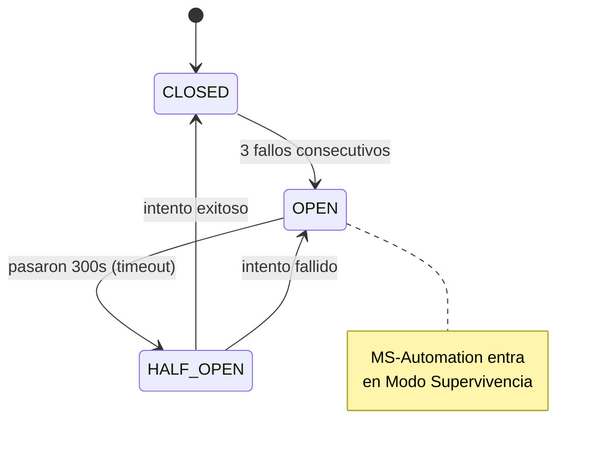

**Contribución a la cadena de valor:** reducción de incidentes (Mejorar), identificar defectos del producto (Obtener/Construir), prevención de repetición (Entrega y Asistencia).

---

## 22. Práctica: Gestión de Solicitudes de Servicio + Catálogo de Servicios

> *Esta práctica no estaba documentada formalmente en la entrega original; se incorpora aquí porque es uno de los conceptos evaluados de la Unidad II.*

**Propósito:** respaldar la calidad acordada del servicio manejando todas las **solicitudes predefinidas iniciadas por el usuario** de forma efectiva y fácil de usar. *Una solicitud de servicio* es una solicitud que inicia una acción acordada como parte normal de la prestación (no es una falla — eso es un incidente).

Tipos de solicitud (Unidad II): acción de entrega de servicio, información, provisión de un recurso, acceso a un servicio, y retroalimentación/quejas/felicitaciones.

### 22.1 Catálogo de Servicios de Cherry‑Tech

El **Catálogo** es el documento oficial que describe todos los servicios, sus canales de solicitud y sus SLA. Es el punto de referencia único entre el equipo técnico y el cliente.

| ID | Servicio | Tipo | SLA | Costo |
|---|---|---|---|---|
| SRV‑C01 | Monitoreo continuo (T°, humedad, pH, radiación, VPD) | Automático | Disponibilidad 99.9 %, latencia < 500 ms | Plan base |
| SRV‑C02 | Control automático de actuadores (riego/ventilación/LED) | Automático | Reacción < 30 s ante umbral superado | Plan base |
| SRV‑C03 | Modo de Supervivencia (continuidad sin internet) | Automático por evento | Activación < 30 s; hasta 72 h autónomas | Plan base |
| SRV‑C04 | Alertas y notificaciones push | Automático | Entrega < 3 s tras la anomalía | Plan base |
| SRV‑I01 | Reporte de Trazabilidad (Pasaporte Digital del lote) | Bajo demanda | Generación < 24 h hábiles | 1/ciclo incluido; extra $350 MXN |
| SRV‑I02 | Exportación de datos históricos (CSV/JSON) | Bajo demanda | < 5 min para rangos ≤ 90 días | Plan base, sin límite |
| SRV‑I03 | Predicción de cosecha (Predictive Yield) | Bajo demanda | — | Plan avanzado |

### 22.2 Flujo de cumplimiento de una solicitud

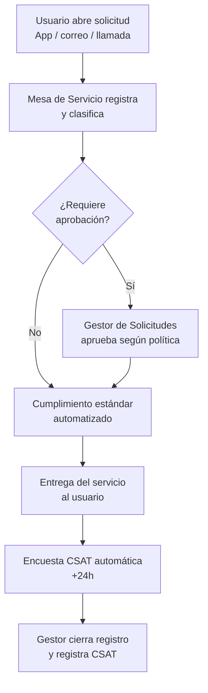

> Las solicitudes y su cumplimiento se **estandarizan y automatizan** en la mayor medida posible; los cambios que generan suelen ser **cambios estándar** (preautorizados).

**Contribución a la cadena de valor:** canal para iniciativas de mejora y quejas (Mejorar), comunicación con interesados (Involucrar), cambios estándar (Diseñar/Transición), entrega normal del servicio (Entrega y Asistencia).

---

## 23. Práctica: Mesa de Servicio (Service Desk)

> *Práctica también ausente en la entrega original; se documenta por ser concepto evaluado.*

**Propósito:** capturar la demanda de resolución de incidentes y solicitudes de servicio, siendo el **punto de contacto único (SPOC)** entre el proveedor y todos sus usuarios. La mesa de servicio tiene gran influencia en la **experiencia del usuario** y debe ser el vínculo empático e informado con cada cliente.

### 23.1 Canales de la Mesa de Servicio de Cherry‑Tech

| Canal | Medio | Disponibilidad | Uso recomendado |
|---|---|---|---|
| **App móvil** | Notificación push / formulario in‑app | 24/7 | Monitoreo, consulta de datos, ajuste de umbrales |
| **Correo** | soporte@cherrytech.mx | Lun‑Vie 8:00‑18:00 | Reportes, alta de usuarios, config. avanzada |
| **Llamada directa** | Número asignado al cliente | 24/7 (P1/P2 fuera de horario) | Incidentes críticos |

### 23.2 Tecnologías y habilidades

La mesa moderna se apoya en **IA, automatización robótica (RPA) y chatbots** para el primer nivel. El personal requiere **empatía, análisis y priorización de incidentes, comunicación efectiva e inteligencia emocional**. La habilidad clave: diagnosticar un incidente en términos de **prioridad comercial** y tomar la acción adecuada.

**Contribución a la cadena de valor:** retroalimentación constante de usuarios (Mejorar), compromiso operacional (Involucrar), soporte de vida temprana en lanzamientos (Diseñar/Transición), gestión de incidentes y solicitudes (Entrega y Asistencia).

---

## 24. Práctica: Gestión de Niveles de Servicio (SLA)

> *La entrega original mencionaba SLAs sueltos; aquí se documenta la práctica formal completa, incluyendo el instrumento de medición de satisfacción (CSAT/NPS).*

**Propósito:** establecer objetivos claros basados en el negocio y garantizar que la prestación se evalúe y gestione contra ellos. *Un nivel de servicio* es una o más métricas que definen la calidad esperada o lograda. *Un SLA* es el acuerdo documentado entre proveedor y cliente que identifica los servicios y el nivel esperado.

Los SLA deben relacionarse con **resultados**, no solo con métricas operativas, usando paquetes equilibrados (p. ej., satisfacción del cliente + resultados de negocio).

### 24.1 Fuentes de información de la SLM

- **Compromiso del cliente** (escucha inicial y descubrimiento).
- **Comentarios del cliente** (encuestas formales e informales → CSAT/NPS).
- **Métricas operativas** (disponibilidad, tiempos de respuesta a incidentes, tiempos de cambio).
- **Métricas de negocio** (lo que el cliente considera valioso: rendimiento del cultivo).

### 24.2 La Encuesta de Satisfacción (CSAT + NPS)

Se envía automáticamente **24 h después de cerrar cada solicitud**. Mide la calidad percibida y alimenta el indicador mensual de satisfacción.

- **CSAT** (escala 1–5): *"¿Qué tan satisfecho estás con el servicio recibido?"* y *"¿Se entregó dentro del SLA prometido?"*
- **NPS** (escala 0–10): *"¿Qué tan probable es que recomiendes Cherry‑Tech a un colega o empresa asociada?"*

Las respuestas se consolidan mensualmente y se presentan junto con los KPIs de incidentes en la **revisión del CAB**.

**Contribución a la cadena de valor:** planificación del portafolio (Planear), mejora según requisitos (Mejorar), compromiso continuo (Involucrar), objetivos para componentes (Obtener/Construir).


---

## 25. Prácticas Técnicas I — Gestión de Implementación (Deployment Management)

> *Las tres prácticas técnicas de ITIL v4 son evaluadas explícitamente en la Unidad II y no estaban formalizadas en la entrega original. Se documentan a continuación.*

**Propósito:** mover hardware, software, documentación o cualquier componente nuevo/modificado a entornos activos (y también a pruebas/staging). Trabaja en estrecha colaboración con Gestión de Versiones y Control de Cambios, pero es una práctica separada.

### 25.1 Los cuatro enfoques de implementación

| Enfoque | Definición | ¿Lo usa Cherry‑Tech? |
|---|---|---|
| **Por fases (phased)** | Se despliega a una parte del entorno a la vez, repitiendo hasta completar. | Parcialmente, en despliegues a grupos de invernaderos piloto. |
| **Entrega continua** | Componentes integrados, probados y desplegados cuando se necesitan; ciclos frecuentes de feedback. | **Sí — enfoque principal** vía pipeline CI/CD. |
| **Big Bang** | Todo se despliega al mismo tiempo (necesario ante dependencias incompatibles, p. ej. cambio de esquema de BD). | Solo para migraciones mayores (InfluxDB v2.x). |
| **Pull** | El software está en un repositorio y el usuario lo descarga cuando desea. | App móvil: el agrónomo actualiza desde la tienda. |

### 25.2 Estrategia de releases — versionado semántico (SemVer)

Cada microservicio sigue **MAYOR.MENOR.PARCHE**:

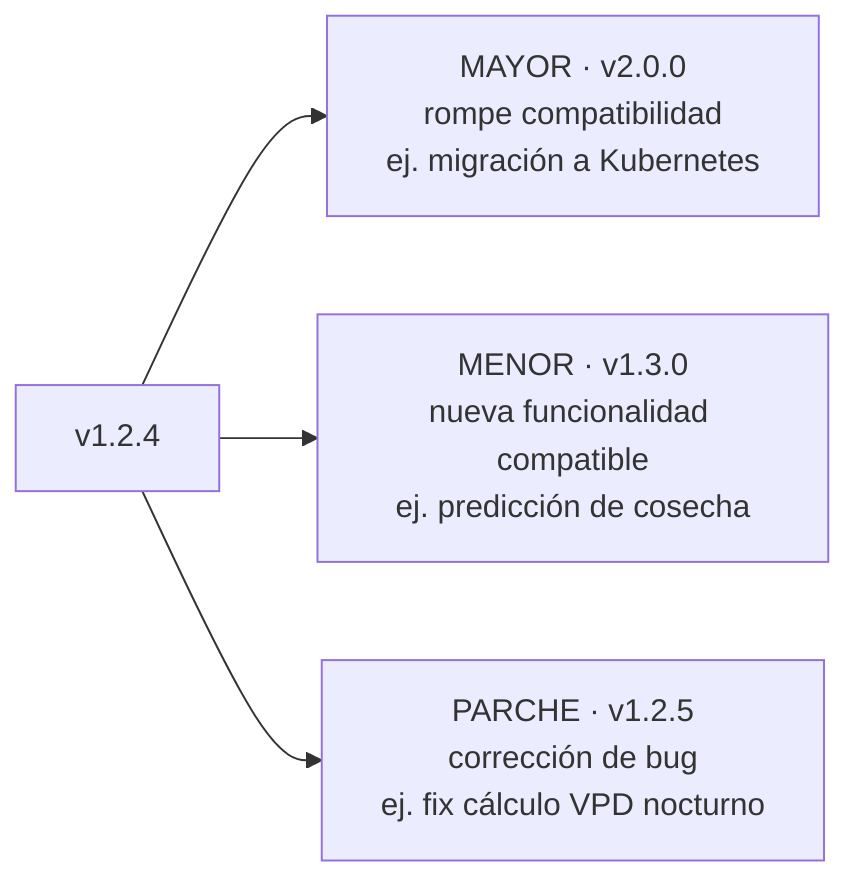

Cada tipo de release tiene su propio proceso de aprobación (un MAYOR es un cambio Mayor que requiere Dirección + CAB).

**Contribución a la cadena de valor:** despliegue incremental común en entornos DevOps con cadena de herramientas automatizada (Obtener/Construir, Diseñar/Transición).

---

## 26. Prácticas Técnicas II — Infraestructura y Plataforma (Respaldo y Recuperación)

**Propósito:** supervisar la infraestructura y plataformas (servidores, almacenamiento, redes, middleware, SO) que proporcionan los entornos para los servicios de TI, pudiendo ser propias o en la nube.

En Cherry‑Tech, la cara más crítica de esta práctica es el **procedimiento de Respaldo y Recuperación**, que materializa la continuidad (ISO 22301).

### 26.1 Objetivos de recuperación

| Concepto | Definición | Objetivo en Cherry‑Tech |
|---|---|---|
| **RTO** (Recovery Time Objective) | Tiempo máximo aceptable para restaurar el servicio. | 2 h (datos críticos), 4 h (históricos) |
| **RPO** (Recovery Point Objective) | Máxima pérdida de datos tolerable, medida en tiempo. | 15 min (telemetría), 24 h (reportes) |
| **MTTR** (Mean Time To Recover) | Tiempo medio de recuperación ante fallo. | < 2 h (alineado al SLA P1) |

### 26.2 Estrategia 3‑2‑1 y frecuencia de respaldo

Cherry‑Tech implementa la **regla 3‑2‑1**: **3** copias de los datos, en **2** tipos de almacenamiento distintos, con **1** copia fuera de sitio (nube cifrada AES‑256).

| Activo | Tipo de respaldo | Frecuencia | Retención | Destino |
|---|---|---|---|---|
| Telemetría InfluxDB | Incremental + snapshot completo | Incremental cada 15 min; snapshot diario 02:00 | 90 días | Local + AWS S3 |
| Configuraciones de microservicios | Completo | Ante cada cambio (RFC) + diario 03:00 | — | Git + nube cifrada |
| Código fuente | Incremental (Git) | Ante cada cambio | — | Repositorio + mirror local |
| Credenciales / secretos | Completo cifrado | Ante cada rotación | — | Bóveda cifrada |

### 26.3 Script de respaldo automático (cron)

```bash
# Script: cherry_backup_influx.sh  (cron diario 02:00)
DATE=$(date +%Y%m%d_%H%M%S)
BACKUP_DIR=/opt/cherry-backups/influx/$DATE

# 1) snapshot de InfluxDB
influx backup "$BACKUP_DIR" --host http://localhost:8086

# 2) cifrar el snapshot (AES-256)
tar -czf - "$BACKUP_DIR" | \
  openssl enc -aes-256-cbc -salt -pass file:/etc/cherry/backup.key \
  -out "$BACKUP_DIR.tar.gz.enc"

# 3) copiar fuera de sitio (regla 3-2-1)
aws s3 cp "$BACKUP_DIR.tar.gz.enc" s3://cherry-backups/influx/

# 4) limpiar snapshots locales > 90 días
find /opt/cherry-backups/influx/ -type d -mtime +90 -exec rm -rf {} +
```

**Contribución a la cadena de valor:** información sobre oportunidades/limitaciones tecnológicas para la planeación (Planear, Mejorar), aporte crítico de componentes a obtener (Obtener/Construir).

---

## 27. Prácticas Técnicas III — Desarrollo y Gestión de Software

**Propósito:** garantizar que las aplicaciones satisfagan las necesidades de los interesados en **funcionalidad, confiabilidad, mantenibilidad, cumplimiento y auditabilidad**. Es una práctica clave en toda organización de TI moderna.

### 27.1 Actividades que abarca (y su evidencia en Cherry‑Tech)

| Actividad (Unidad II) | Evidencia en Cherry‑Tech |
|---|---|
| Arquitectura de soluciones | Arquitectura de 5 microservicios desacoplados |
| Diseño de soluciones (UI, servicios) | Dashboard + API REST/WebSocket (FastAPI) |
| Desarrollo de software | Python (paho‑mqtt, numpy, ReportLab) |
| **Pruebas** (unitarias, integración, regresión, seguridad, aceptación) | Pytest ≥ 80 %, integración con Docker Compose, SAST con Bandit/Trivy |
| Gestión de repositorios | Git + GitHub, 1 repo por microservicio |
| Creación de paquetes | Imágenes Docker por servicio (< 500 MB) |
| Control de versiones | SemVer + tags de Git |

### 27.2 Ciclo de vida del componente de software

La gestión de software rastrea el componente **desde la ideación hasta el retiro**, en mejora continua:

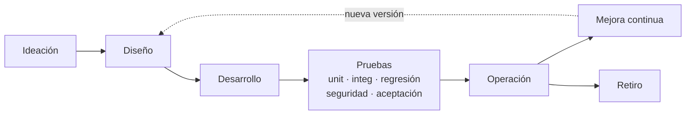

### 27.3 Principios de la mejora continua del software (procedimiento formal)

- **Mejora basada en datos:** toda decisión se sustenta en métricas reales (CSAT, KPIs de incidentes, cobertura, rendimiento). No se mejora por intuición.
- **Iteraciones cortas y entregables:** cada sprint de 2 semanas genera una versión deployable validable con el cliente.
- **Calidad no negociable:** ningún cambio llega a producción sin pasar el pipeline CI/CD completo (cobertura ≥ 80 %).
- **Alineación con el negocio:** el backlog se prioriza con el cliente (agrónomo y dueño) en la revisión de sprint.

**Contribución a la cadena de valor:** información para crear/cambiar software (Planear), base de las mejoras (Mejorar), diseño integral de cambios (Diseñar/Transición), creación de productos internos (Obtener/Construir), documentación para soporte (Entrega y Soporte).

---

## 28. Prácticas generales transversales: Riesgo y Seguridad de la Información

- **Gestión de Riesgos:** matriz probabilidad × impacto en cada RFC (§19.3); análisis de causa raíz de las debilidades/amenazas del FODA con 5 Porqués; controles para cada riesgo sin solución inmediata (p. ej., catálogo de hardware equivalente ante volatilidad de semiconductores).
- **Seguridad de la Información:** **TLS** en la comunicación MQTT, **JWT** para autenticación y autorización (solo el administrador modifica umbrales), y escaneo **SAST** (Bandit/Trivy) en el pipeline para detectar vulnerabilidades antes de producción. La rotación de un JWT comprometido es un **cambio de emergencia**.

---

## 29. Tablero de KPIs — la voz del sistema

Las métricas miden la salud del **proceso de gestión completo**. Se calculan mensualmente y se presentan al CAB. **Snapshot de cierre de abril 2026:**

| KPI | Valor | Objetivo | Estado |
|---|---|---|---|
| MTTR promedio | 1 h 52 m | < 2 h (P1) | 🟢 OK |
| MTTA promedio | 11 min | < 15 min | 🟢 OK |
| Cumplimiento SLA | 97.5 % | > 95 % | 🟢 OK |
| Uptime del sistema | 99.94 % | > 99.9 % | 🟢 OK |
| Incidentes P1 | 1 | 0 / mes | 🔴 ALERTA |
| Tasa de recurrencia | 25 % | < 10 % | 🔴 ALERTA |
| RP sin causa raíz | 1 | 0 | 🟡 REVISIÓN |
| MTBF broker MQTT | 12 días | > 30 días | 🔴 ALERTA |

### Interpretación y acciones correctivas

| Hallazgo | Acción | Responsable |
|---|---|---|
| 1 incidente P1 (riego nocturno) | Revisión obligatoria del CAB; verificar plan de RP‑2026‑001 | CAB |
| Recurrencia 25 % (umbral 10 %) | Identificar incidentes recurrentes; abrir RP si no existen | Gestor de Problemas |
| MTBF broker solo 12 días | Priorizar RP‑2026‑001; evaluar upgrade del broker | Líder Técnico |
| 1 RP sin causa raíz | Intensificar investigación; deadline 7 días | Líder Técnico |

> **Tres conclusiones del Parcial II:** (1) ITIL **no se opone a lo ágil — se complementa**; PDCA y los 7 pasos se mapean con Scrum y DevOps. (2) Los formatos (RFC, Ticket, Registro de Problema) **no son burocracia — son memoria**: sin ellos, cada incidente se resuelve dos veces. (3) La **trazabilidad técnica es la trazabilidad del negocio**: versionado, tags y registros del CAB componen un *Pasaporte Digital* que el cliente muestra a un comprador internacional.


---
---

# PARTE III — TERCER PARCIAL
## Despliegue de servicios: DevOps y CI/CD sobre Cherry‑Tech (Unidad III)

> Si el Parcial I diseñó el sistema y el Parcial II lo gobernó, el Parcial III responde: **¿cómo se entrega y opera de forma automática, rápida, fiable y observable?** La respuesta es un pipeline CI/CD completo. El pipeline es, literalmente, la materialización técnica de las prácticas ITIL de *Gestión de Cambios* y *Mejora Continua* del Parcial II.

---

## 30. Marco conceptual de la Unidad III y matriz de trazabilidad

La Unidad III aborda el **Despliegue de servicios** bajo *Continuous Delivery* y **DevOps** —una cultura que une desarrollo y operaciones. Enumera siete categorías de herramientas/prácticas que este proyecto implementa una por una sobre Cherry‑Tech.

### Matriz de trazabilidad: concepto → implementación → evidencia

| # | Concepto Unidad III | § | Herramienta implementada | Evidencia |
|---|---|---|---|---|
| 1 | Control de Versiones | §32.1 | Git + GitHub (SSH ed25519) | Config. + flujo de ramas |
| 2 | Integración Continua (CI) | §32.2 | Jenkins (containerizado) | Dockerfile §34.1 + Jenkinsfile §34.4 |
| 3 | Orquestación de Contenedores | §32.3 | Docker + Docker Compose | Dockerfile §34.2 + Compose §34.3 |
| 4 | Automatización de Despliegue (IaC) | §32.4 | Dockerfile/Compose/Jenkinsfile versionados | Todos los §34 |
| 5 | Monitoreo y Gestión de Errores | §32.5 | Prometheus + Grafana + cAdvisor | prometheus.yml §34.5 + alertas §34.6 |
| 6 | Gestión de Configuración | §32.6 | Variables de entorno + Secrets | §32.6 + `.env` excluido |
| 7 | Operación Continua | §32.7 | Rolling Update + Circuit Breaker | Modo Supervivencia |
| 8 | Pipeline CI/CD (integrador) | §33 | Jenkinsfile maestro (8 etapas) | Diagramas §33 + §34.4 |

---

## 31. Arquitectura DevOps integral — las 4 capas

La arquitectura recorre el camino desde el invernadero físico hasta la operación monitoreada en producción, en cuatro capas.

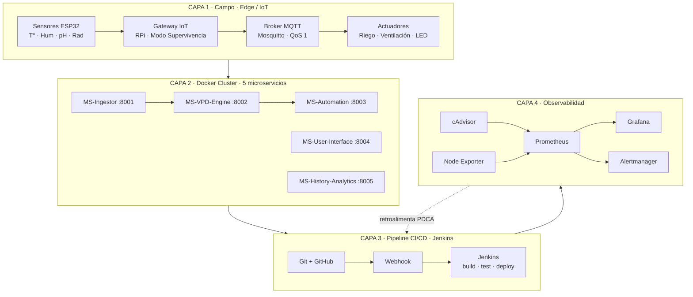

- **Capa 1 — Campo (Edge/IoT):** sensores → gateway → broker MQTT → actuadores; incluye Modo Supervivencia.
- **Capa 2 — Docker Cluster:** los 5 microservicios como contenedores independientes, cada uno en su puerto.
- **Capa 3 — Pipeline CI/CD:** Jenkins orquesta el ciclo de vida, disparado por webhooks de GitHub.
- **Capa 4 — Observabilidad:** Prometheus recolecta métricas (cAdvisor + Node Exporter), Grafana visualiza, Alertmanager alerta. Retroalimenta la planeación (cierra el PDCA).

---

## 32. Los 7 conceptos de la Unidad III aplicados

### 32.1 Concepto 1 — Control de Versiones (Git + GitHub)

Las herramientas de control de versiones rastrean cambios, facilitan la colaboración y garantizan la integridad del código. Cherry‑Tech eligió **Git** (distribuido) sobre GitHub. Justificación: estándar de la industria, modelo distribuido coherente con la filosofía edge, soporte nativo de webhooks (esencial para CI) y ramas ligeras.

**Estrategia:** un **repositorio por microservicio** (cambios atómicos). Flujo de ramas: `main` (protegida, siempre desplegable) y `feature/*` (desarrollo). Cada cambio entra a `main` solo vía pull request que dispara el pipeline.

**Configuración (Práctica P01):** `git init -b main`, autenticación con **llave SSH ed25519**, `.gitignore` que excluye dependencias y secretos (`.env`), y conexión por URL SSH. El código fuente es el primer **elemento de configuración (CI)** del sistema.

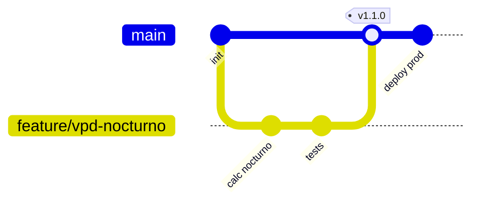

### 32.2 Concepto 2 — Integración Continua (Jenkins)

Las herramientas de CI automatizan construcción y pruebas en cada cambio, con retroalimentación inmediata. Cherry‑Tech eligió **Jenkins**: infraestructura propia (on‑premise, datos sensibles), extensibilidad por plugins, **Pipeline as Code** (Jenkinsfile versionado) y madurez/comunidad.

**Configuración (P01):** Jenkins **containerizado** (imagen personalizada que añade Python, Git y Docker CLI), `docker-compose.yml` con volumen `jenkins_home` persistente, y plugins de GitHub, Branch Source y Pipeline. La fase de CI cubre las primeras 4 etapas (lint, unitarias, integración, SAST).

### 32.3 Concepto 3 — Orquestación de Contenedores (Docker + Kubernetes)

Docker y Kubernetes gestionan y despliegan aplicaciones en contenedores de forma eficiente y escalable. **Docker** es la base: consistencia entre entornos (adiós "funciona en mi máquina"), aislamiento, inmutabilidad de imágenes (facilita rollback). **Kubernetes** está en el roadmap (v2.0.0) para alta disponibilidad real, auto‑escalado y auto‑recuperación.

**Buenas prácticas en cada imagen:** base ligera (`python:3.12-slim`), instalar dependencias antes de copiar código (caché de capas), técnica multi‑stage, separación dev/prod, **usuario no privilegiado**. Para dev/staging, **Docker Compose** levanta los 5 microservicios + broker + InfluxDB con un solo comando.

**Reto técnico — Docker out of Docker (DooD):** como Jenkins corre en un contenedor, se monta el socket `/var/run/docker.sock` del host dentro del contenedor de Jenkins para que pueda construir y desplegar otros contenedores (más eficiente y seguro que "Docker in Docker").

### 32.4 Concepto 4 — Automatización de Despliegue (IaC)

Ansible/Puppet/Chef permiten definir **infraestructura como código (IaC)**. Cherry‑Tech materializa el principio con su stack containerizado: los **Dockerfile** definen cada entorno de ejecución, el **docker‑compose.yml** define la topología completa, y el **Jenkinsfile** define el proceso de despliegue. Todo versionado en Git → la infraestructura es **reproducible, versionada y auditable**. En migración a Kubernetes, se complementaría con Helm o Terraform.

### 32.5 Concepto 5 — Monitoreo y Gestión de Errores (Prometheus + Grafana)

El monitoreo en tiempo real es crucial en DevOps. Cherry‑Tech usa **Prometheus + Grafana** + cAdvisor + Node Exporter + Alertmanager. Justificación: estándar cloud‑native (CNCF, igual que Kubernetes), modelo *pull* adecuado para contenedores, integración nativa, open source.

**Alertas que importan** (no solo métricas genéricas): disponibilidad de servicios (`up == 0`, la más crítica es MS‑Automation), latencia del cálculo VPD (SLA 100 ms), uso de recursos por contenedor (fugas de memoria) y del host. Habilita los **cuatro Golden Signals** del SRE: latencia, tráfico, errores y saturación. Corresponde a la práctica ITIL de *Monitoring & Event Management* del Parcial II.

### 32.6 Concepto 6 — Gestión de Configuración

Consul/etcd gestionan configuración dinámica. Cherry‑Tech usa **variables de entorno** y archivos `.env` inyectados en runtime (nunca en las imágenes), cumpliendo la metodología **Twelve‑Factor App**: separación de configuración y código (la misma imagen corre en dev/staging/prod cambiando solo variables), gestión segura de secretos (JWT, credenciales InfluxDB inyectados en runtime, nunca versionados), y parámetros críticos configurables (umbrales VPD ajustables como **cambio estándar** por temporada). En Kubernetes evolucionaría a ConfigMaps y Secrets.

### 32.7 Concepto 7 — Operación Continua

Mantener y operar la infraestructura en producción de forma confiable. Para Cherry‑Tech es **supervivencia del cultivo**:

- **Rolling Updates (sin downtime):** se reemplazan instancias una a una; el MS‑Automation nunca deja de controlar el riego.
- **Escalabilidad horizontal:** en maduración del fruto se despliegan contenedores adicionales del MS‑VPD‑Engine (Gestión de Capacidad y Demanda del Parcial I).
- **Resiliencia (Circuit Breaker + Modo Supervivencia):** si se pierde la nube, el edge ejecuta rutinas preprogramadas (Service Continuity Management).
- **Monitoreo y retroalimentación:** las métricas de Prometheus alimentan la mejora continua, reiniciando el PDCA.


---

## 33. El pipeline CI/CD unificado de 8 etapas

El pipeline es el corazón que integra todos los conceptos. Actúa como **"el guardián de la calidad"**: ningún cambio aprobado por el CAB puede saltárselo, y un fallo en cualquier etapa bloquea el avance (*fail fast*).

```mermaid
flowchart TD
    subgraph CI["INTEGRACIÓN CONTINUA (CI)"]
        E1[1 · Lint y formato<br/>Pylint / Black · ~2 min<br/>Criterio: cero errores]
        E2[2 · Pruebas unitarias<br/>Pytest · ~5 min<br/>Criterio: cobertura ≥ 80%]
        E3[3 · Pruebas de integración<br/>Docker Compose + Pytest · ~10 min<br/>Criterio: endpoints OK]
        E4[4 · SAST seguridad<br/>Bandit / Trivy · ~5 min<br/>Criterio: 0 vuln. críticas]
    end
    subgraph CD["ENTREGA CONTINUA (CD)"]
        E5[5 · Build imagen Docker<br/>~5 min · Criterio: imagen < 500 MB]
        E6[6 · Despliegue a staging<br/>~5 min · Criterio: healthcheck OK]
        E7{7 · Aprobación manual<br/>Líder Técnico / CAB · < 24h}
        E8[8 · Despliegue a producción<br/>Rolling · ~5 min · Cero downtime]
    end
    E1 --> E2 --> E3 --> E4 --> E5 --> E6 --> E7
    E7 -- Aprobado --> E8
    E7 -- Rechazado --> STOP[Bloqueo]
```

| # | Etapa | Herramienta | Criterio de paso | Tiempo |
|---|---|---|---|---|
| 1 | Lint y formato | Pylint / Black | Cero errores | ~2 min |
| 2 | Pruebas unitarias | Pytest | 100 % pasan, cobertura ≥ 80 % | ~5 min |
| 3 | Pruebas de integración | Docker Compose + Pytest | Endpoints HTTP esperados | ~10 min |
| 4 | SAST (seguridad) | Bandit / Snyk / Trivy | 0 vulnerabilidades críticas | ~5 min |
| 5 | Build imagen Docker | Docker Build | Imagen < 500 MB | ~5 min |
| 6 | Despliegue a staging | Docker Compose / K8s | Healthcheck OK | ~5 min |
| 7 | Aprobación manual | Revisión humana | Aprobación del CAB | < 24 h |
| 8 | Despliegue a producción | Docker Swarm / K8s Rolling | Cero downtime | ~5 min |

Las etapas **1‑4 son la CI** (validan que el código es correcto y seguro); las **5‑8 son la CD** (empaquetan, despliegan, verifican). La **etapa 7 (aprobación manual)** es la *compuerta humana* que distingue *Continuous Delivery* de *Continuous Deployment*, alineada con la Gestión de Cambios del Parcial II.

### 33.1 Flujo de secuencia — ¿qué pasa al hacer `git push`?

```mermaid
sequenceDiagram
    participant Dev as Desarrollador
    participant GH as GitHub
    participant NG as Ngrok
    participant JK as Jenkins
    participant DK as Docker
    participant PR as Producción
    participant PM as Prometheus

    Dev->>GH: 1. git push (cambio MS-VPD-Engine)
    GH->>NG: 2. webhook (POST)
    NG->>JK: 3. túnel → /github-webhook/
    JK->>GH: 4. checkout: clona el repo
    Note over JK: 5-8. CI: Lint, Pytest (≥80%),<br/>Integración, SAST<br/>si algo falla → STOP (fail fast)
    JK->>DK: 9. docker build imagen
    DK-->>JK: 10-11. imagen <500MB, tag BUILD_NUMBER + latest
    JK->>JK: 12. deploy a staging
    JK->>Dev: 13. solicita aprobación manual (CAB)
    Dev->>JK: 14. aprueba (compuerta humana)
    JK->>PR: 15. Rolling Update (cero downtime)
    JK->>PR: 16. health check (curl 200 OK)
    PR->>PM: 17. expone /metrics
    PM->>PM: 18. scrape cada 15s
    Note over Dev,PM: Resultado: nueva versión en producción y<br/>monitoreada — sin intervención salvo el paso 14
```

Salvo el paso 14 (aprobación humana, deliberadamente manual por gobernanza), **ningún otro paso requiere intervención**: el cambio fluye solo desde el editor del desarrollador hasta el invernadero monitoreado. El disparador es un **webhook de GitHub**; durante el desarrollo (P01) se usó **Ngrok** para exponer el Jenkins local.

---

## 34. Configuración técnica real (código de todas las herramientas)

Cada bloque es un artefacto real del proyecto, versionado en Git como parte del principio de IaC.

### 34.1 Dockerfile de Jenkins (imagen CI personalizada)

```dockerfile
FROM jenkins/jenkins:lts
USER root
# Herramientas de build y test para los microservicios + utilidades
RUN apt-get update && apt-get install -y \
    python3 python3-pip python3-venv \
    git curl unzip ca-certificates \
    && rm -rf /var/lib/apt/lists/*
# Docker CLI: para que Jenkins construya y despliegue contenedores (DooD)
RUN install -m 0755 -d /etc/apt/keyrings && \
    curl -fsSL https://download.docker.com/linux/debian/gpg \
      -o /etc/apt/keyrings/docker.asc && \
    echo "deb [arch=$(dpkg --print-architecture) \
      signed-by=/etc/apt/keyrings/docker.asc] \
      https://download.docker.com/linux/debian \
      $(. /etc/os-release && echo $VERSION_CODENAME) stable" \
      > /etc/apt/sources.list.d/docker.list && \
    apt-get update && apt-get install -y docker-ce-cli && \
    rm -rf /var/lib/apt/lists/*
USER root
```

> **Decisión clave:** se instala solo `docker-ce-cli` (el cliente), no el daemon. El daemon vive en el host y se accede por el socket montado (técnica DooD, §32.3).

### 34.2 Dockerfile de un microservicio (producción) — MS‑VPD‑Engine

```dockerfile
FROM python:3.12-slim
ENV PYTHONUNBUFFERED=1 \
    PYTHONDONTWRITEBYTECODE=1
WORKDIR /app
# Instalar dependencias primero (aprovecha el caché de capas)
COPY requirements.txt .
RUN pip install --no-cache-dir -r requirements.txt
# Copiar el código del microservicio
COPY . .
# Usuario no privilegiado (buena práctica de seguridad)
RUN useradd -m appuser && chown -R appuser:appuser /app
USER appuser
EXPOSE 8002
# Healthcheck nativo de Docker
HEALTHCHECK --interval=30s --timeout=5s --retries=3 \
    CMD curl -f http://localhost:8002/health || exit 1
CMD ["python", "main.py"]
```

### 34.3 docker‑compose.yml (orquestación del ecosistema)

```yaml
services:
  mosquitto:
    image: eclipse-mosquitto:2.0
    container_name: cherry-mqtt
    ports: ["1883:1883"]
    networks: [cherry-net]

  ms-ingestor:
    build: ./ms-ingestor
    container_name: cherry-ingestor
    environment:
      - MQTT_HOST=mosquitto
      - MQTT_QOS=1
    depends_on: [mosquitto]
    networks: [cherry-net]
    restart: unless-stopped

  ms-vpd-engine:
    build: ./ms-vpd-engine
    container_name: cherry-vpd
    environment:
      - VPD_MIN=0.8
      - VPD_MAX=1.2
    depends_on: [ms-ingestor]
    networks: [cherry-net]
    restart: unless-stopped
    deploy:
      replicas: 1   # escalable horizontalmente en maduración

  ms-automation:
    build: ./ms-automation
    container_name: cherry-automation
    environment:
      - CIRCUIT_BREAKER=enabled
      - SURVIVAL_MODE=enabled
    depends_on: [ms-vpd-engine]
    networks: [cherry-net]
    restart: unless-stopped

  influxdb:
    image: influxdb:2.7
    container_name: cherry-influx
    volumes: ["influx_data:/var/lib/influxdb2"]
    networks: [cherry-net]

volumes:
  influx_data:
networks:
  cherry-net:
```

> Los umbrales de VPD se inyectan como variables (gestión de configuración); `restart: unless-stopped` aporta resiliencia; `replicas` habilita el escalado horizontal.

### 34.4 Jenkinsfile (Pipeline as Code — las 8 etapas)

```groovy
pipeline {
  agent any
  environment {
    IMAGE_NAME     = 'cherry-ms-vpd-engine'
    CONTAINER_NAME = 'cherry-vpd'
    APP_PORT       = '8002'
    VPD_MIN        = '0.8'
    VPD_MAX        = '1.2'
  }
  stages {
    // ===== INTEGRACIÓN CONTINUA (CI) =====
    stage('1. Lint y formato') {
      steps {
        sh 'pylint --fail-under=9 *.py || true'
        sh 'black --check .'
      }
    }
    stage('2. Pruebas unitarias') {
      steps { sh 'pytest --cov=. --cov-fail-under=80' }
    }
    stage('3. Pruebas de integración') {
      steps {
        sh 'docker compose -f docker-compose.test.yml up -d'
        sh 'pytest tests/integration/'
        sh 'docker compose -f docker-compose.test.yml down'
      }
    }
    stage('4. SAST - Seguridad') {
      steps {
        sh 'bandit -r . -ll'
        sh 'trivy fs --severity CRITICAL,HIGH .'
      }
    }
    // ===== ENTREGA CONTINUA (CD) =====
    stage('5. Build imagen Docker') {
      steps {
        sh "docker build -t ${IMAGE_NAME}:${BUILD_NUMBER} ."
        sh "docker tag ${IMAGE_NAME}:${BUILD_NUMBER} ${IMAGE_NAME}:latest"
      }
    }
    stage('6. Despliegue a staging') {
      steps {
        sh "docker run -d --name ${CONTAINER_NAME}-staging \
            -e VPD_MIN=${VPD_MIN} -e VPD_MAX=${VPD_MAX} \
            ${IMAGE_NAME}:${BUILD_NUMBER}"
      }
    }
    stage('7. Aprobación manual') {
      steps { input message: '¿Desplegar a producción?', submitter: 'lider-tecnico' }
    }
    stage('8. Despliegue a producción (Rolling)') {
      steps {
        sh """
          docker stop ${CONTAINER_NAME} || true
          docker rm ${CONTAINER_NAME} || true
          docker run -d --name ${CONTAINER_NAME} \
            -p ${APP_PORT}:8002 \
            -e VPD_MIN=${VPD_MIN} -e VPD_MAX=${VPD_MAX} \
            --restart unless-stopped --label monitoring=enabled \
            ${IMAGE_NAME}:${BUILD_NUMBER}
        """
      }
    }
  }
  post {
    success { echo '== PIPELINE EXITOSO: MS-VPD-Engine desplegado ==' }
    failure { echo '== PIPELINE FALLIDO: revisar etapa con error ==' }
    always  { sh 'docker image prune -f || true' }
  }
}
```

> La etapa 7 usa `input` restringido al rol `lider-tecnico`, materializando la compuerta de aprobación (CAB) del Parcial II.

### 34.5 prometheus.yml (configuración del monitoreo)

```yaml
global:
  scrape_interval: 15s
  evaluation_interval: 15s
alerting:
  alertmanagers:
    - static_configs:
        - targets: ['alertmanager:9093']
rule_files:
  - 'alert.rules.yml'
scrape_configs:
  - job_name: 'prometheus'
    static_configs: [{ targets: ['localhost:9090'] }]
  - job_name: 'node-exporter'        # métricas del host
    static_configs: [{ targets: ['node-exporter:9100'] }]
  - job_name: 'cadvisor'             # métricas de contenedores
    static_configs: [{ targets: ['cadvisor:8080'] }]
  - job_name: 'cherry-microservicios'
    static_configs:
      - targets: ['cherry-vpd:8002', 'cherry-automation:8003', 'cherry-ingestor:8001']
```

### 34.6 alert.rules.yml (reglas de alerta de Cherry‑Tech)

```yaml
groups:
  - name: alertas_cherry_tech
    rules:
      - alert: MicroservicioCaido
        expr: up == 0
        for: 1m
        labels: { severity: critica }
        annotations:
          summary: "Microservicio {{ $labels.job }} caído"
          description: "Riesgo para el control del cultivo."
      - alert: LatenciaVPDAlta
        expr: vpd_calculation_seconds > 0.1
        for: 2m
        labels: { severity: advertencia }
        annotations:
          summary: "MS-VPD-Engine supera su SLA de 100ms"
      - alert: AutomationSinResponder
        expr: up{job="cherry-microservicios", instance="cherry-automation:8003"} == 0
        for: 30s
        labels: { severity: critica }
        annotations:
          summary: "MS-Automation caído — riego sin control"
          description: "Activar Modo Supervivencia (Edge)."
```

> `AutomationSinResponder` es la alerta más crítica: si cae el MS‑Automation, el cultivo queda sin control de riego, por lo que dispara en apenas **30 segundos**.

### 34.7 Evidencias de implementación (checklist)

Para generar las evidencias se ejecuta `docker compose up -d` en los tres directorios (microservicios, jenkins‑ci, monitoring), se levanta el túnel con `ngrok http 8080` y se hace un `git push` de prueba:

1. Repositorio en GitHub con commits, Jenkinsfile y Dockerfile versionados.
2. Webhook con *delivery* 200 OK.
3. Jenkins: *Stage View* con las 8 etapas en verde.
4. Jenkins: *Console Output* del build y pruebas.
5. `docker ps` con microservicios + stack de monitoreo activos.
6. Grafana: dashboard de CPU/memoria de los microservicios.
7. Prometheus: *Targets* en estado UP.
8. Endpoint del microservicio respondiendo tras el despliegue.

### 34.8 Integración con las 5 prácticas del tercer parcial

| Práctica | Concepto Unidad III | Herramientas | Aporte |
|---|---|---|---|
| P01 — Desarrollo Continuo | Control de versiones + CI | Git, GitHub, Jenkins, webhook, Ngrok | Base del pipeline: build + test por push |
| P02 — Entrega Continua | Orquestación de contenedores | Docker, DooD, Dockerfile de la app | Build de imágenes y despliegue automatizado |
| P03 — Operación Continua | Monitoreo y gestión de errores | Prometheus, Grafana, cAdvisor, Node Exporter, Alertmanager | Observabilidad y alertas |
| P04 — Pipeline completo | Ciclo de vida unificado | Jenkinsfile maestro (CI+CD+OPS) | Integración de todas las fases |
| P05 — Tradicional vs DevOps | Continuous Delivery y DevOps | Diagrama comparativo | Fundamentación conceptual |

---

## 35. Tradicional vs. DevOps y métricas DORA

### 35.1 La transformación

- **Escenario tradicional (lo que se evitó):** modelo en cascada, integración manual al final, pruebas manuales, despliegue "big bang". Un error en el VPD descubierto en producción implicaría un ciclo largo de corrección y un despliegue riesgoso — durante el cual el cultivo podría sufrir daños irreversibles.
- **Escenario DevOps (lo que se implementó):** una corrección se desarrolla, se prueba automáticamente, se despliega gradual sin downtime y queda monitoreada — todo en minutos, con riesgo mínimo.

| Dimensión | Tradicional | DevOps (Cherry‑Tech) |
|---|---|---|
| Frecuencia de entrega | Meses | Por cada cambio aprobado |
| Detección de errores | Tardía | Temprana (fail fast) |
| Riesgo por release | Alto | Bajo |
| Retroalimentación | Lenta | Inmediata |

### 35.2 Métricas DORA

| Métrica DORA | Qué mide | Estado en Cherry‑Tech |
|---|---|---|
| **Deployment Frequency** | Frecuencia de despliegues | Por cada cambio aprobado (alta) |
| **Lead Time for Changes** | Tiempo de commit a producción | ~37 min + aprobación |
| **Change Failure Rate** | % de despliegues que fallan | Bajo (4 compuertas de validación) |
| **MTTR** | Tiempo de recuperación ante fallo | Bajo (rollback + alertas) |

**KPIs específicos del negocio agrícola** (en Grafana): latencia del cálculo VPD < 100 ms; disponibilidad del MS‑Automation > 99.9 %; tasa de mensajes MQTT (objetivo 100 msg/seg); cobertura de pruebas > 80 %.


---
---

# SÍNTESIS Y CIERRE

## 36. Los tres parciales como una sola historia

El valor de este documento no está en cada herramienta aislada, sino en cómo las tres etapas cuentan una **historia coherente de madurez** sobre el mismo sistema:

```mermaid
flowchart LR
    subgraph P1[PARCIAL 1 · Diseñar]
        A1[Unidad I · Estrategias de TI<br/>basadas en servicios]
        A2[5 microservicios<br/>Arquitectura desacoplada]
        A3[VPD · ASABE · Modo Supervivencia]
        A4[ITIL v4: SVS, 4 dimensiones,<br/>utilidad y garantía]
        A5[Pregunta: ¿Cómo está<br/>diseñado el sistema?]
    end
    subgraph P2[PARCIAL 2 · Gobernar]
        B1[Unidad II · Gestión de Servicios]
        B2[Mejora continua PDCA + 7 pasos]
        B3[Cambios CAB · Incidentes · Problemas]
        B4[Solicitudes · Mesa de Servicio · SLA]
        B5[3 Prácticas Técnicas]
        B6[Pregunta: ¿Cómo se gestiona<br/>el servicio con disciplina?]
    end
    subgraph P3[PARCIAL 3 · Automatizar]
        C1[Unidad III · Despliegue de servicios]
        C2[Control versiones · CI · Docker]
        C3[Monitoreo · Config · Operación]
        C4[Pipeline CI/CD de 8 etapas]
        C5[Pregunta: ¿Cómo se entrega<br/>y opera de forma automática?]
    end
    P1 -->|la aplicación existe| P2
    P2 -->|el servicio se gobierna| P3
    P3 -->|el ciclo es continuo| FIN[✅ Sistema completo:<br/>diseñado, gobernado<br/>y auto-operado]
```

| | Parcial 1 — Diseñar | Parcial 2 — Gobernar | Parcial 3 — Automatizar |
|---|---|---|---|
| **Unidad** | I | II | III |
| **Qué responde** | ¿Qué se construyó? | ¿Cómo se gobierna? | ¿Con qué se automatiza? |
| **Resultado** | La aplicación existe | El servicio se gestiona | El ciclo es continuo |
| **Concepto puente** | Cadena de valor del servicio | Control de Cambios + Mejora Continua | Pipeline CI/CD |

La trazabilidad es directa: las **prácticas ITIL del Parcial II** definieron *qué* procesos gobiernan el sistema; el **pipeline del Parcial III** los *automatiza*. El pipeline CI/CD es la materialización técnica de "Gestión de Cambios" y "Mejora Continua".

---

## 37. Conclusiones generales

1. **Un servicio no se entrega y se olvida; es una promesa de valor que se renueva en cada interacción.** En Cherry‑Tech esa promesa es mantener vivo y productivo un cultivo de tomate Cherry. La arquitectura, la gobernanza ITIL y la automatización no son fines en sí mismos: son los medios que garantizan que esa promesa se cumpla de forma rápida, fiable y sostenible.

2. **ITIL no se opone a lo ágil ni a DevOps — los integra.** El SVS, las cuatro dimensiones, el PDCA y los siete pasos de mejora se mapean limpiamente con Scrum y con el pipeline CI/CD. La disciplina de gestión y la velocidad de entrega conviven sin fricción.

3. **La trazabilidad técnica es la trazabilidad del negocio.** El versionado semántico, los tags de Git, las firmas del pipeline y los registros del CAB componen un *Pasaporte Digital* que el cliente puede mostrar a un comprador internacional: "esta es la historia de mi tomate".

4. **La continuidad de un activo biológico no admite improvisación.** El Modo Supervivencia (edge), el Circuit Breaker, el plan de rollback y las alertas a 30 segundos existen porque treinta segundos de mal cálculo pueden costar un lote. Cada decisión de arquitectura se justifica en el valor de negocio.

5. **Relación final con ITIL 4:** el proyecto materializa la Cadena de Valor del Servicio —Planear, Mejorar, Involucrar, Diseñar y Transición, Obtener/Construir, Entregar y Soportar— y encarna el principio guía *"optimiza y automatiza"*. Cherry‑Tech demuestra que un proyecto de software, por especializado que sea, **vive y respira mejor cuando se le da un marco formal de gestión y se le dota de las herramientas de automatización que ese marco requiere**.

### Roadmap (próximos pasos)

- Migración a **Kubernetes** (v2.0.0) para alta disponibilidad real y auto‑escalado.
- **Registry de imágenes privado** y despliegues **Blue‑Green** para eliminar todo downtime.
- Separación del **broker MQTT** (control vs. telemetría) — solución definitiva de RP‑2026‑001.
- Observabilidad de tres pilares: **logs (Loki)** y **trazas distribuidas (Tempo/OpenTelemetry)**.

---

## 38. Referencias

- Humble, J. & Farley, D. (2010). *Continuous Delivery: Reliable Software Releases through Build, Test, and Deployment Automation*. Addison‑Wesley.
- Kim, G., Humble, J., Debois, P., & Willis, J. (2016). *The DevOps Handbook*. IT Revolution Press.
- Forsgren, N., Humble, J., & Kim, G. (2018). *Accelerate: The Science of Lean Software and DevOps*. IT Revolution Press.
- Beyer, B., Jones, C., Petoff, J., & Murphy, N. R. (2016). *Site Reliability Engineering*. O'Reilly Media.
- AXELOS. (2019). *ITIL Foundation: ITIL 4 Edition*. The Stationery Office.
- Material del curso: **Unidad I** — Estrategias de TI basadas en servicios; **Unidad II** — Gestión de los Servicios; **Unidad III** — Despliegue de servicios. Gestión de Servicios de TI.
- ISO/IEC 20000 — *Information technology — Service management*.
- ISO 22301 — *Business continuity management systems*.
- Wiggins, A. *The Twelve‑Factor App*. https://12factor.net/
- Jenkins Project — *Pipeline Documentation*. https://www.jenkins.io/doc/book/pipeline/
- Docker Inc. — *Docker Documentation*. https://docs.docker.com/
- Prometheus Authors — *Prometheus Documentation*. https://prometheus.io/docs/
- Grafana Labs — *Grafana Documentation*. https://grafana.com/docs/
- Google Cloud — *DORA: DevOps Research and Assessment*. https://dora.dev/

---

<div align="center">

**Proyecto Integrador — Ecosistema Cherry‑Tech**
*Diseñar (P1) → Gobernar (P2) → Automatizar (P3) = un sistema completo, gestionado y auto‑operado*

Daniel Alejandro Sánchez Ahumada · Registro 23310411 · 6N
Gestión de Servicios de TI · Prof. José Francisco Pérez Reyes · Junio 2026

</div>
